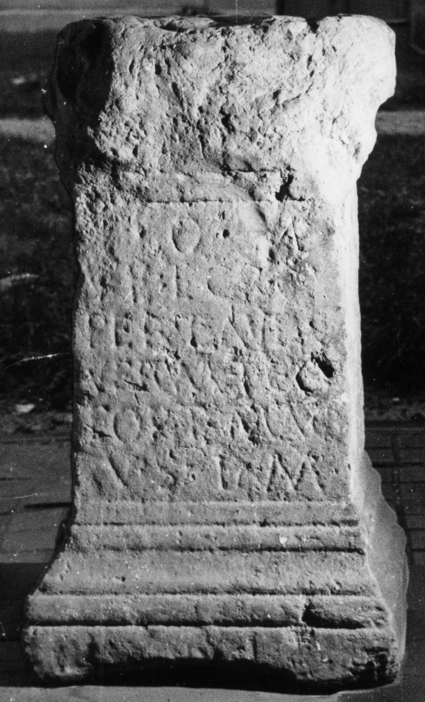

# EDH HD017051. Micia, aus

**Країна.** Румунія

**Провінція (код EDH).** Dac

**Місце знахідки (антична назва).** Micia, aus

**Сучасна назва.** Avrig

**Деталі знахідки.** {Schloß Brukenthal, Park}

**Координати.** 45.730456731,24.375958441

**Зберігання.** Sibiu, Muz. Brukenthal

**Датування (роки, від'ємні до н. е.).** 107 … 200

**Матеріал.** Kalkstein

**Тип пам'ятки.** Altar

**Розміри (висота, ширина, глибина, см).** 70.0 × -39.0 × -29.0

## Текст (латинь, скорочення розкрито)

```
I(ovi) O(ptimo) M(aximo) / vet(erani) et c(ives) R(omani) M(icienses) / per T(itum) Aurel(ium) / Verum et Cor(nelium) / Fort(unatum) mag(istros) / v(otum) s(olverunt) l(ibentes) m(erito)
```

## Текст у вихідному записі

```
I O M / VET ET C R M / PER T AVREL / VERVM ET COR / FORT MAG / V S L M
```

## Коментар

Lesung nach Russu. (B): AE 1911, Téglás, AE 1960, Daicoviciu: abweichende Textwiedergaben.

## Література

AE 1980, 0781.
- AE 1911, 0040. (B)
- AE 1960, p. 97 s. n. 375. (B)
- I.I. Russu, StCercIstorV 31, 1980, 450, Nr. 3; fig. 3 (Zeichnung). - AE 1980.
- C. Daicoviciu, AISC 4, 1941-1943, 317-318, Anm. 1. (B) - AE 1960.
- G. Téglás, Klio 10, 1910, 504, Nr. 10, 1. (B) - AE 1911.
- IDR 3, 3, 082; fig. 66 (Foto u. Zeichnung). #

## Фото



Джерело https://edh.ub.uni-heidelberg.de/edh/inschrift/HD017051, ліцензія CC BY-SA 4.0. Оригінальний XML в архіві сирі_дані/edh_xml.zip
