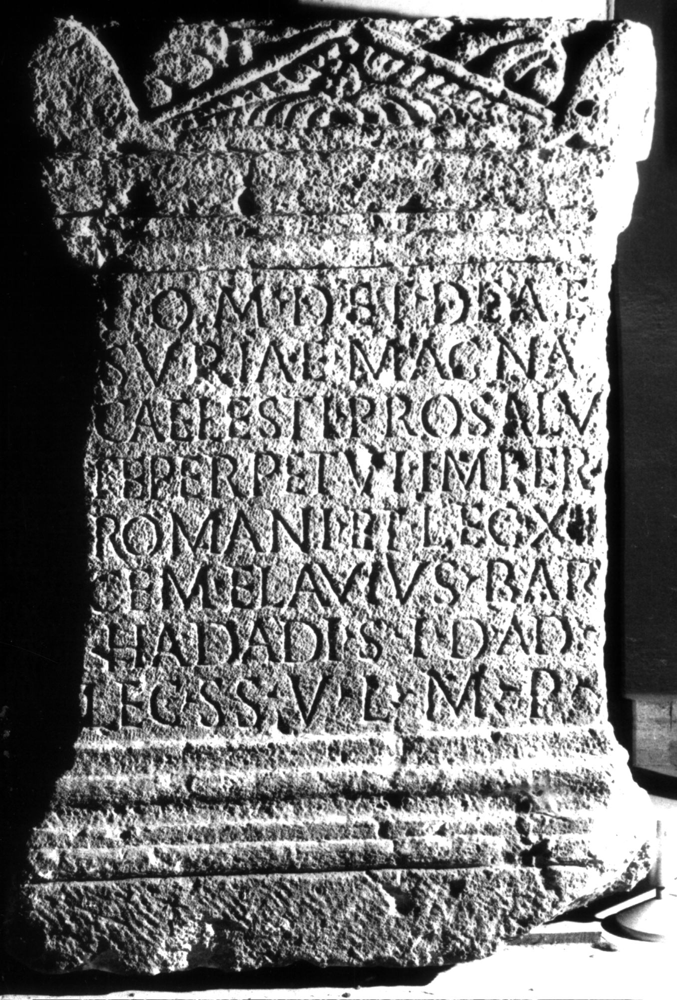
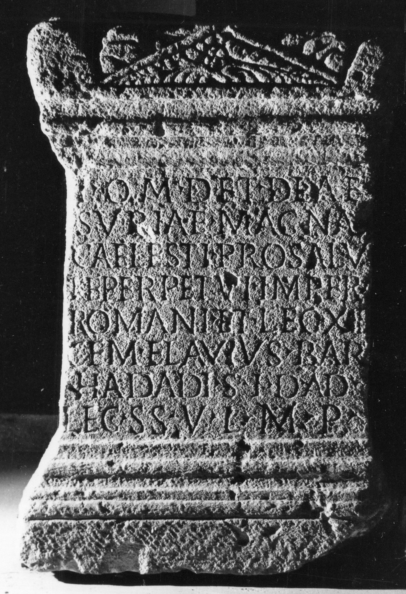

# EDH HD017317. Apulum

**Країна.** Румунія

**Провінція (код EDH).** Dac

**Місце знахідки (антична назва).** Apulum

**Сучасна назва.** Alba Iulia

**Деталі знахідки.** Carolina, {Bulevardul Încoronării 32}, bei

**Координати.** 46.063509204,23.571360111

**Рік знахідки.** 1963

**Зберігання.** Alba Iulia, Muz. Unirii

**Датування (роки, від'ємні до н. е.).** 171 … 230

**Матеріал.** Sandstein

**Тип пам'ятки.** Altar

**Розміри (висота, ширина, глибина, см).** 77.0 × 74.0 × 25.0

## Текст (латинь, скорочення розкрито)

```
I(ovi) O(ptimo) M(aximo) D(olicheno) et Deae / Suriae Magna[e] / Caelesti pro salu/te perpetui imperi(i) / Romani et leg(ionis) XIII / gem(inae) <F=E>lavius#<F>lavius#ELAVIUS Bar/hadadi s(acerdos) I(ovis) D(olicheni) ad / leg(ionem) s(upra) s(criptam) v(otum) l(ibens) m(erito) p(osuit)
```

## Текст у вихідному записі

```
I O M D ET DEAE / SVRIAE MAGNA[ ] / CAELESTI PRO SALV / TE PERPETVI IMPERI / ROMANI ET LEG XIII / GEM ELAVIVS BAR / HADADI S I D AD / LEG S S V L M P
```

## Коментар

Z. 6/7: Bar/hadadi: semitische Filiationsangabe (Sohn des Hadad) als ""cognomen"". (B): Berciu - Popa; AE 1965; Angyal; AE 1975; Petolescu; CCID: Abweichungen in der Lesung.

## Література

AE 2006, 1125.
- AE 1975, 0719. (B)
- AE 1972, 0460.
- AE 1965, 0030. (B)
- IDR 3, 5, 221; Foto.
- C.C. Petolescu, in: A. Vigourt - X. Loriot - A. Bérenger-Badel - B. Klein (Hrsg.), Pouvoir et religion dans le monde romain en hommage à Jean-Pierre Martin (Paris 2006) 463, Nr. 3. (B) - AE 2006.
- K.B. Angyal, Studium 2, 1971, 17-19, Nr. 1. (B) - AE 1975.
- I. Berciu - A. Popa, Latomus 23, 1964, 473-482; pl. 26, 1 (Foto u. Zeichnung). (B) - AE 1965.
- I. Berciu - A. Popa, Apulum 5, 1964, 172-180, Nr. 3; fig. 3 (Zeichnung). (B)
- CCID 154; Taf. 30. (B) #

## Фото





Джерело https://edh.ub.uni-heidelberg.de/edh/inschrift/HD017317, ліцензія CC BY-SA 4.0. Оригінальний XML в архіві сирі_дані/edh_xml.zip
