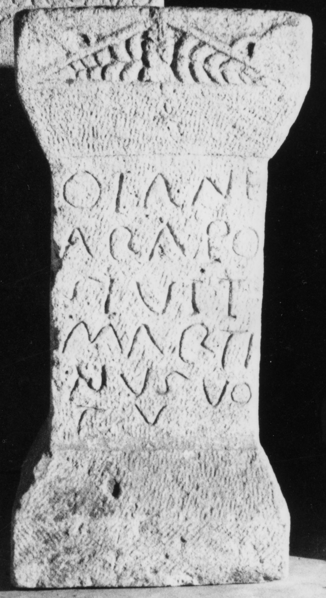

# EDH HD017323. Apulum, aus?

**Країна.** Румунія

**Провінція (код EDH).** Dac

**Місце знахідки (антична назва).** Apulum, aus?

**Сучасна назва.** Ighiu

**Деталі знахідки.** {Șard}

**Координати.** 46.123370000,23.531130599

**Зберігання.** Alba Iulia, Muz. Unirii

**Датування (роки, від'ємні до н. е.).** 151 … 300

**Матеріал.** Sandstein

**Тип пам'ятки.** Altar

**Розміри (висота, ширина, глибина, см).** 58.5 × 29.0 × 25.0

## Текст (латинь, скорочення розкрито)

```
Dian(a)e / ara(m) po/sivit(!) / Marti/nus vo/tu(m)
```

## Текст у вихідному записі

```
DIANE / ARA PO / SIVIT / MARTI / NVS VO / TV
```

## Коментар

(B): Téglás, AE 1911: Z. 2/3: po/suit; Herkunft nach IDR 3, 5: aufgetaucht 1857 im Kunsthandel; vermutlich aus Apulum oder den römischen Ruinen von Ampoiţa (Meteş, jud. Alba).

## Література

AE 1911, 0038. (B)
- AE 1965, 0031.
- J. Berciu - A. Popa, Apulum 5, 1965, 187-189, Nr. 5; fig. 6. - AE 1965.
- IDR 3, 5, 053; Foto.
- IDR 3, 4, 045; fig. 23 (Foto u. Zeichnung).
- G. Téglás, Klio 10, 1910, 503, Nr. 2. - AE 1911. #

## Фото



Джерело https://edh.ub.uni-heidelberg.de/edh/inschrift/HD017323, ліцензія CC BY-SA 4.0. Оригінальний XML в архіві сирі_дані/edh_xml.zip
