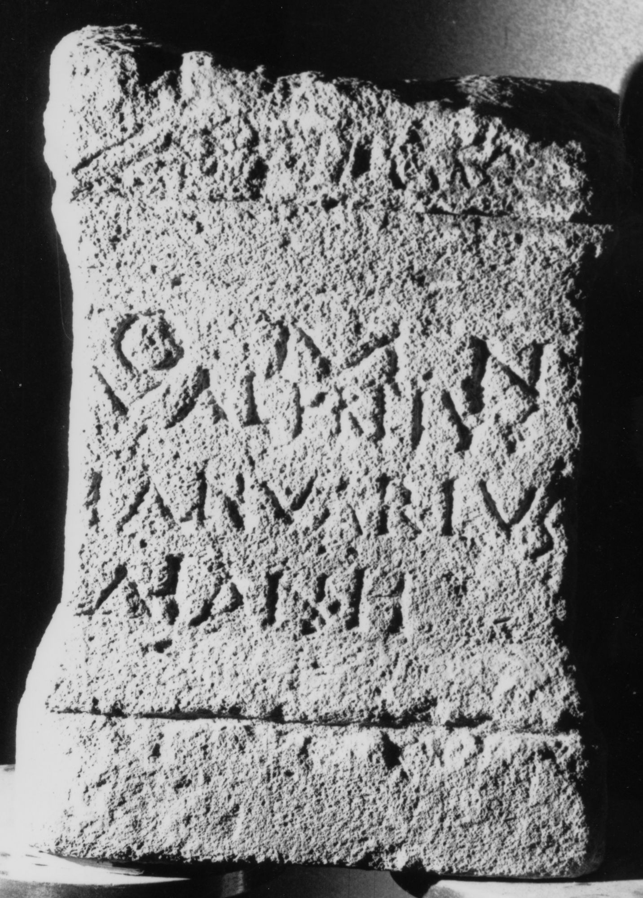

# EDH HD017326. Apulum, aus?

**Країна.** Румунія

**Провінція (код EDH).** Dac

**Місце знахідки (антична назва).** Apulum, aus?

**Сучасна назва.** Ighiu

**Деталі знахідки.** {Șard}

**Координати.** 46.123370000,23.531130599

**Рік знахідки.** 1957

**Зберігання.** Alba Iulia, Muz. Unirii

**Датування (роки, від'ємні до н. е.).** 101 … 300

**Матеріал.** Kalkstein

**Тип пам'ятки.** Altar

**Розміри (висота, ширина, глибина, см).** 43.0 × 32.0 × 23.0

## Текст (латинь, скорочення розкрито)

```
O M N / Val(erii?) Primus / Ianuarius / Διάνῃ
```

## Текст у вихідному записі

```
O M N / VAL PRIMVS / IANVARIVS / ΔΙΑΝΗ
```

## Коментар

(B): Berciu, AE 1965, IDR 3, 4: abweichende Lesungen. Textwiedergabe nach IDR 3, 5. Herkunft nach IDR 3, 5: aufgetaucht im Kunsthandel 1957; vermutlich aus Apulum oder den römischen Ruinen von Ampoiţa (Meteş, jud. Alba).

## Література

AE 1965, 0032. (B)
- I. Berciu - A. Popa, Apullum 5, 1965, 189-190, Nr. 6; fig. 7. (B) - AE 1965.
- IDR 3, 5, 056; Foto u. Zeichnung.
- IDR 3, 4, 046; fig. 24 (Foto u. Zeichnung). (B) #

## Фото



Джерело https://edh.ub.uni-heidelberg.de/edh/inschrift/HD017326, ліцензія CC BY-SA 4.0. Оригінальний XML в архіві сирі_дані/edh_xml.zip
