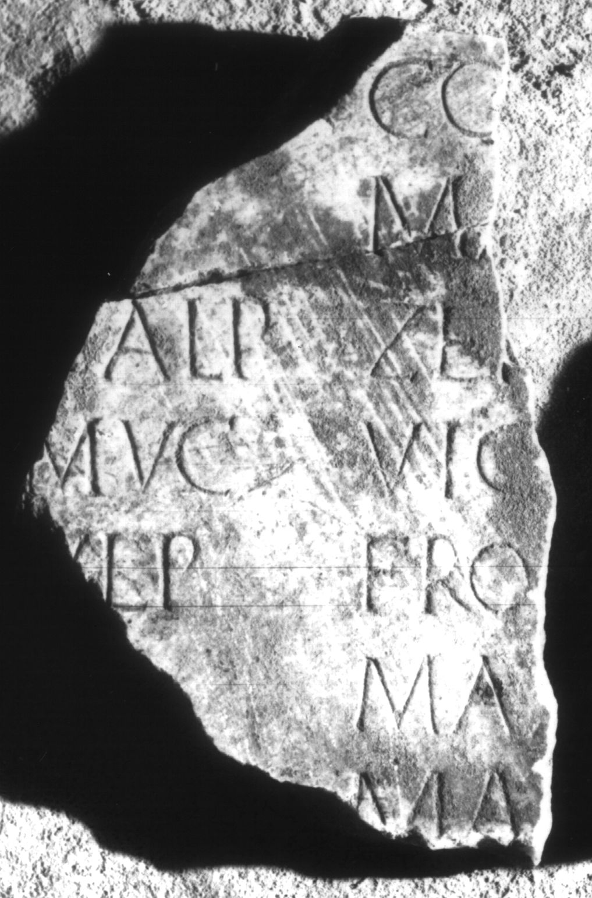

# EDH HD017338. Apulum

**Країна.** Румунія

**Провінція (код EDH).** Dac

**Місце знахідки (антична назва).** Apulum

**Сучасна назва.** Alba Iulia

**Деталі знахідки.** {Platoul Romanilor}

**Координати.** 46.0724587,23.556527400

**Зберігання.** Alba Iulia, Muz. Unirii

**Датування (роки, від'ємні до н. е.).** 107 … 200

**Матеріал.** Marmor

**Тип пам'ятки.** Tafel

**Розміри (висота, ширина, глибина, см).** -17.5 × -11.0 × 2.5

## Текст (латинь, скорочення розкрито)

```
$] / [---] Co[---] / [---] Ma[---] / [C]alp(urnius) Zen[o] / Muc(ius) Vic[tor?] / Ulp(ius) Fro[nto?] / [---] Max/[imus?] / [---] Ma[---] / [&
```

## Текст у вихідному записі

```
] / [ ] CO[ ] / [ ] MA[ ] / [ ]ALP ZEN[ ] / MVC VIC[ ] / VLP FRO[ ] / [ ] MAX / [ ] / [ ] MA[ ] / [
```

## Коментар

Zwei aneinanderpassende Fragmente einer Tafel.

## Література

AE 1965, 0037.
- I. Berciu - A. Popa, Apulum 5, 1965, 198, Nr. 14. - AE 1965.
- IDR 3, 5, 458; Foto u. Zeichnung. #

## Фото



Джерело https://edh.ub.uni-heidelberg.de/edh/inschrift/HD017338, ліцензія CC BY-SA 4.0. Оригінальний XML в архіві сирі_дані/edh_xml.zip
