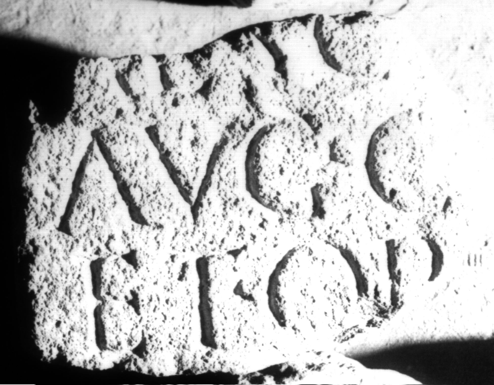

# EDH HD017344. Apulum

**Країна.** Румунія

**Провінція (код EDH).** Dac

**Місце знахідки (антична назва).** Apulum

**Сучасна назва.** Alba Iulia

**Деталі знахідки.** Festung, {Prinzenpalast, bei}

**Координати.** 46.066274449,23.571684426

**Рік знахідки.** 1961

**Зберігання.** Alba Iulia, Muz. Unirii

**Датування (роки, від'ємні до н. е.).** 107 … 250

**Матеріал.** Sandstein

**Тип пам'ятки.** Tafel

**Розміри (висота, ширина, глибина, см).** -14.0 × -22.0 × 23.0

## Текст (латинь, скорочення розкрито)

```
[------] / AL[-]C[---] / [---] Aug(ustalis) c[ol(oniae) ---] / et or[dinis? ---?] / [------]
```

## Текст у вихідному записі

```
[ ] / AL[ ]C[ ] / [ ] AVG C[ ] / ET OR[ ] / [ ]
```

## Коментар

Lesung nach IDR.

## Література

AE 1965, 0038b.
- I. Berciu - A. Popa, Apulum 5, 1964, 199, Nr. 16; fig. 14. - AE 1965.
- IDR 3, 5, 670, Foto u. Zeichnung. #

## Фото



Джерело https://edh.ub.uni-heidelberg.de/edh/inschrift/HD017344, ліцензія CC BY-SA 4.0. Оригінальний XML в архіві сирі_дані/edh_xml.zip
