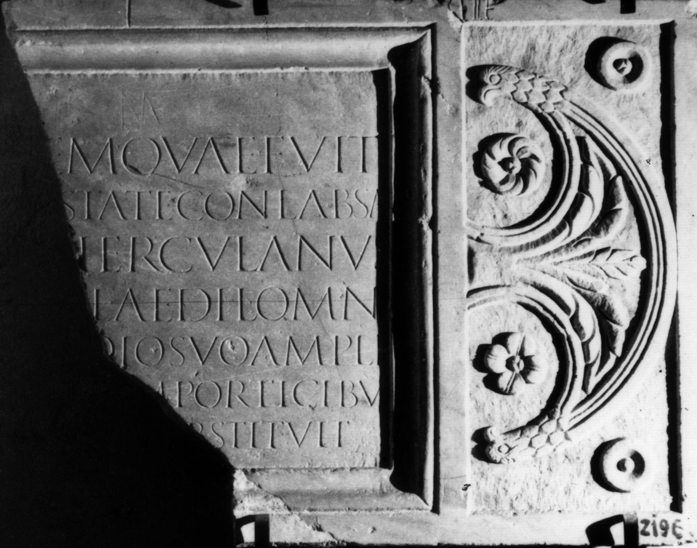
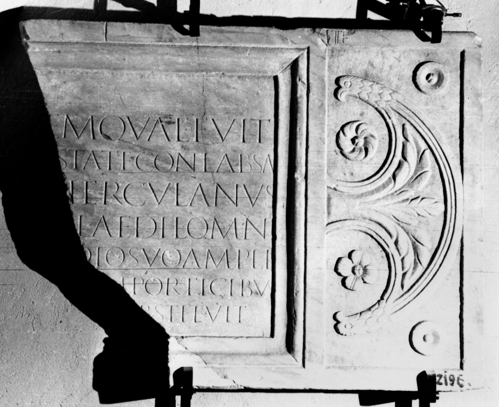

# EDH HD017357. Colonia Ulpia Traiana Sarmizegetusa, aus

**Країна.** Румунія

**Провінція (код EDH).** Dac

**Місце знахідки (антична назва).** Colonia Ulpia Traiana Sarmizegetusa, aus

**Сучасна назва.** Hunedoara

**Деталі знахідки.** {Hăşdat}

**Координати.** 45.7356341,22.923709400

**Зберігання.** Deva, Muz. Civil. Dac. şi Rom.

**Датування (роки, від'ємні до н. е.).** 131 … 200

**Тип пам'ятки.** Tafel

**Розміри (висота, ширина, глибина, см).** 74.0 × -96.0 × 5.0

## Текст (латинь, скорочення розкрито)

```
[------](?) / [aed]em quae fuit / [vetu]state conlabsa(!) / [---] Herculanus / [dec(urio) co]l(oniae) aedil(is) omni / [impen]dio suo ampli/[avit cu]m porticibus / [---] restituit(?)
```

## Текст у вихідному записі

```
[ ] / [ ]EM QVAE FVIT / [ ]STATE CONLABSA / [ ] HERCVLANVS / [ ]L AEDIL OMNI / [ ]DIO SVO AMPLI / [ ]M PORTICIBVS / [ ] RESTITVIT
```

## Коментар

Z. 7: vor S ein B, P oder R; möglicherweise Buchstabe E vergessen oder RE-Ligatur. Lesungs- und Ergänzungsvorschlag nach Gostar. (B): AE 1957; IDR III 2: Leseabweichungen.

## Література

AE 1957, 0198. (B)
- N. Gostar, MatCercA 2, 1956, 639-642; fig. 2 (Zeichnung). - AE 1957.
- IDR 3, 2, 007; fig. 6 (Zeichnung). (B) #

## Фото





Джерело https://edh.ub.uni-heidelberg.de/edh/inschrift/HD017357, ліцензія CC BY-SA 4.0. Оригінальний XML в архіві сирі_дані/edh_xml.zip
