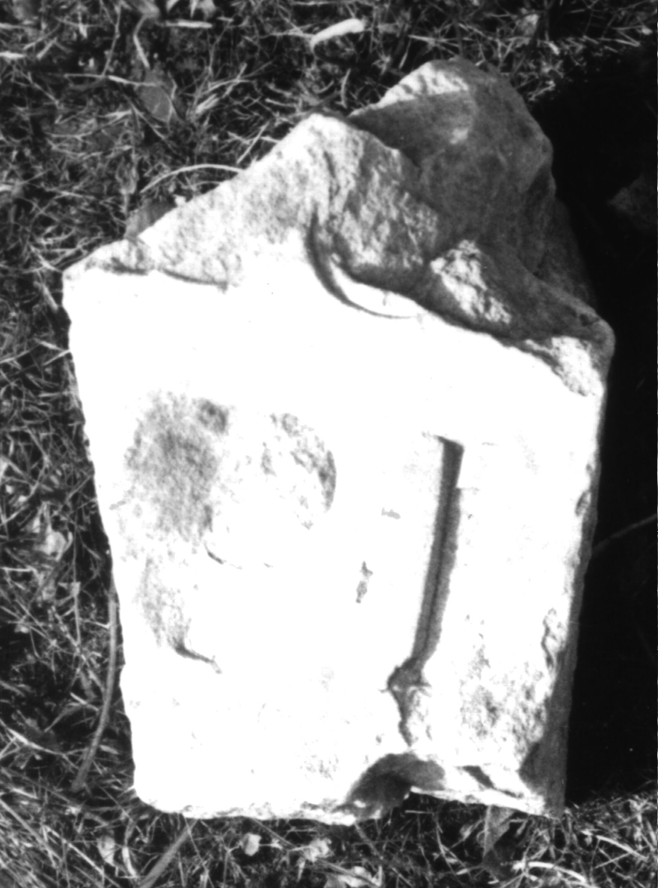

# EDH HD017372. Colonia Ulpia Traiana Sarmizegetusa

**Країна.** Румунія

**Провінція (код EDH).** Dac

**Місце знахідки (антична назва).** Colonia Ulpia Traiana Sarmizegetusa

**Сучасна назва.** Sarmizegetusa

**Координати.** 45.516666699,22.783333299

**Зберігання.** Sarmizegetusa, Muz. Arh.

**Датування (роки, від'ємні до н. е.).** 107 … 275

**Розміри (висота, ширина, глибина, см).** -20.0 × -13.5 × 13.0

## Текст (латинь, скорочення розкрито)

```
$] / [---]L(?)O(?) / [---]PI / [&
```

## Текст у вихідному записі

```
] / [ ]LO / [ ]PI / [
```

## Література

I. Piso, Apulum 14, 1976, 451-452, Nr. 12; fig. 12. #

## Фото



Джерело https://edh.ub.uni-heidelberg.de/edh/inschrift/HD017372, ліцензія CC BY-SA 4.0. Оригінальний XML в архіві сирі_дані/edh_xml.zip
