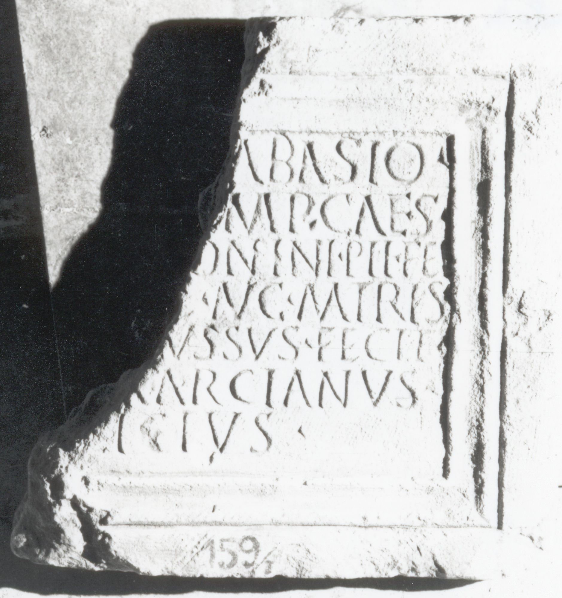

# EDH HD017767. Apulum

**Країна.** Румунія

**Провінція (код EDH).** Dac

**Місце знахідки (антична назва).** Apulum

**Сучасна назва.** Alba Iulia

**Деталі знахідки.** {Festung}

**Координати.** 46.068288248,23.571209907

**Зберігання.** Alba Iulia, Muz. Unirii

**Датування (роки, від'ємні до н. е.).** 212 … 217

**Матеріал.** Kalkstein

**Тип пам'ятки.** Tafel

**Розміри (висота, ширина, глибина, см).** -40.0 × 34.0 × 6.0

## Текст (латинь, скорочення розкрито)

```
[I(ovi) O(ptimo) M(aximo) S]abasio / [pro sal(ute) I]mp(eratoris) Caes(aris) / [M(arci) Aur(eli) Ant]onini Pii Fel(icis) / [Aug(usti) et Iul(iae)] Aug(usti) matris / [Aug(ustae) a deo i]ussus fecit / [L(ucius?) Aur(elius?) M]arcianus / [aedi]licius
```

## Текст у вихідному записі

```
[ ]ABASIO / [ ]MP CAES / [ ]ONINI PII FEL / [ ] AVG MATRIS / [ ]VSSVS FECIT / [ ]ARCIANVS / [ ]LICIVS
```

## Коментар

Linker Teil der Tafel nicht erhalten.

## Література

AE 1961, 0082.
- M. Macrea, Dacia 3, 1959, 325-327, Nr. 1; fig. 1. - AE 1961.
- IDR 3, 5, 225; Foto u. Zeichnung. #

## Фото



Джерело https://edh.ub.uni-heidelberg.de/edh/inschrift/HD017767, ліцензія CC BY-SA 4.0. Оригінальний XML в архіві сирі_дані/edh_xml.zip
