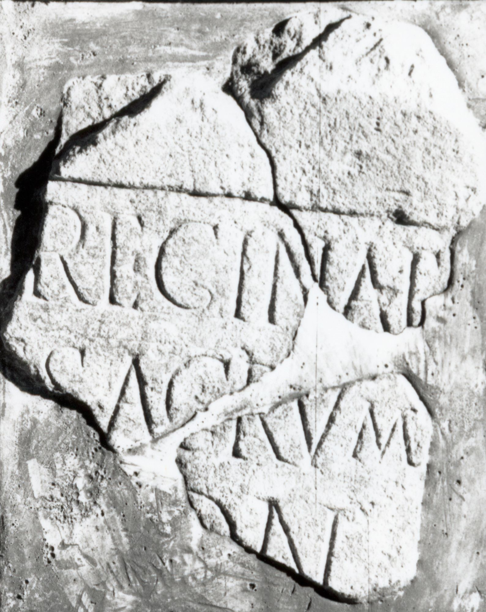

# EDH HD018248. Apulum

**Країна.** Румунія

**Провінція (код EDH).** Dac

**Місце знахідки (антична назва).** Apulum

**Сучасна назва.** Alba Iulia

**Деталі знахідки.** Praetorium des Statthalters

**Координати.** 46.076691,23.580099

**Зберігання.** Alba Iulia, Muz. Unirii

**Датування (роки, від'ємні до н. е.).** 151 … 275

**Матеріал.** Kalkstein

**Тип пам'ятки.** Altar?

**Розміри (висота, ширина, глибина, см).** -30.0 × -7.0 × -5.5

## Текст (латинь, скорочення розкрито)

```
[Eponae?] Reginae / [---] sacrum / [---]on(ius) / [&
```

## Текст у вихідному записі

```
[ ] REGINAE / [ ] SACRVM / [ ]ON / [
```

## Коментар

Drei aneinander passende Fragmente eines Altars oder Statuenbasis. IDR 3, 5: nicht weit von Nr. 068 gefunden.

## Література

IDR 3, 5, 069; Foto. #

## Фото



Джерело https://edh.ub.uni-heidelberg.de/edh/inschrift/HD018248, ліцензія CC BY-SA 4.0. Оригінальний XML в архіві сирі_дані/edh_xml.zip
