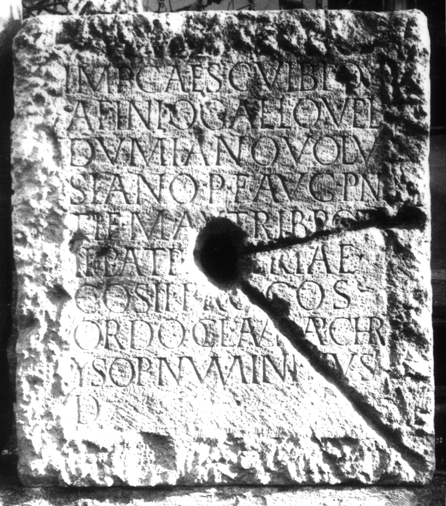
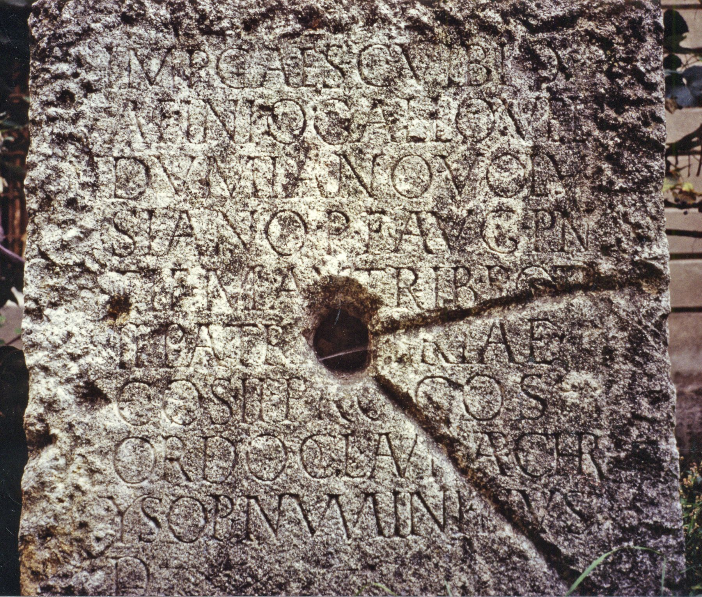

# EDH HD018375. Apulum

**Країна.** Румунія

**Провінція (код EDH).** Dac

**Місце знахідки (антична назва).** Apulum

**Сучасна назва.** Alba Iulia

**Деталі знахідки.** Partoş, {Strada Reg. 5 Vânători} 156

**Координати.** 46.044366509,23.564338050

**Рік знахідки.** 1970

**Зберігання.** Alba Iulia, Muz. Unirii

**Датування (роки, від'ємні до н. е.).** 252 … 

**Матеріал.** Gesteine

**Тип пам'ятки.** Statuenbasis

**Розміри (висота, ширина, глибина, см).** 101.0 × 90.0 × 53.0

## Текст (латинь, скорочення розкрито)

```
Imp(eratori) Caes(ari) C(aio) Vibio / Afinio Gallo Vel/dumiano Volu/siano P(io) F(elici) Aug(usto) pon/tif(ici) max(imo) trib(unicia) pot(estate) / II patr[i pa]triae / co(n)s(uli) II proco(n)s(uli) / ordo col(oniae) Aur(eliae) Ap(ulensis) Chr/ysop(olis) numini eius / d(edicavit)
```

## Текст у вихідному записі

```
IMP CAES C VIBIO / AFINIO GALLO VEL / DVMIANO VOLV / SIANO P F AVG PON / TIF MAX TRIB POT / II PATR[ ]TRIAE / COS II PROCOS / ORDO COL AVR AP CHR / YSOP NVMINI EIVS / D
```

## Коментар

Mittelteil einer Statuenbasis; in späterer Zeit (vielleicht schon in der Antike) als Baustein wiederverwendet.

## Література

AE 1989, 0628.
- IDR 3, 5, 432; Foto u. Zeichnung.
- A. Popa - I.A. Aldea, in: Akten des VI. Internationalen Kongresses für Griechische und Lateinische Epigraphik, München 1972, 490-492; Taf. 7, 3. - AE 1989. #

## Фото





Джерело https://edh.ub.uni-heidelberg.de/edh/inschrift/HD018375, ліцензія CC BY-SA 4.0. Оригінальний XML в архіві сирі_дані/edh_xml.zip
