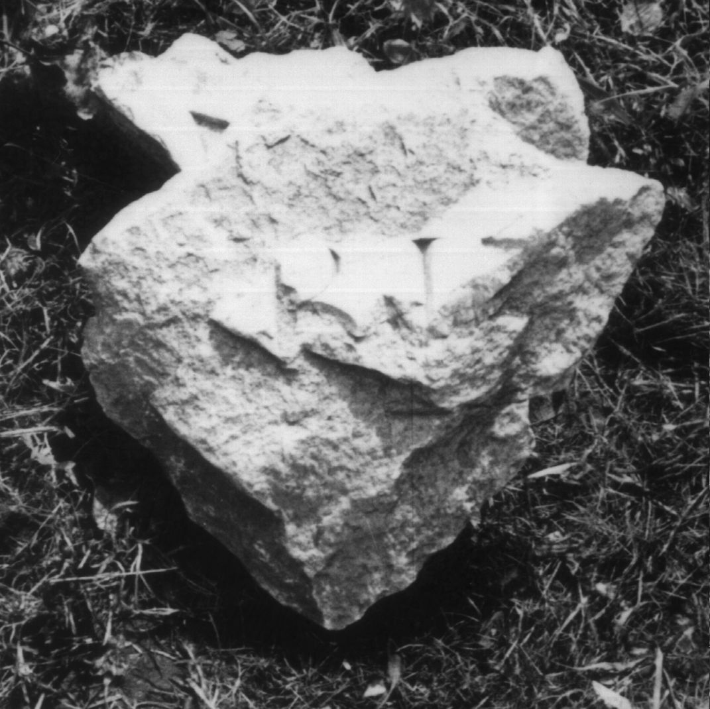

# EDH HD018476. Colonia Ulpia Traiana Sarmizegetusa

**Країна.** Румунія

**Провінція (код EDH).** Dac

**Місце знахідки (антична назва).** Colonia Ulpia Traiana Sarmizegetusa

**Сучасна назва.** Sarmizegetusa

**Координати.** 45.516666699,22.783333299

**Зберігання.** Sarmizegetusa, Muz. Arh.

**Датування (роки, від'ємні до н. е.).** 107 … 275

**Розміри (висота, ширина, глибина, см).** -21.0 × -22.0 × 4.0

## Текст (латинь, скорочення розкрито)

```
$]BIT[&
```

## Текст у вихідному записі

```
]BIT[
```

## Література

I. Piso, Apulum 14, 1976, 451, Nr. 13; fig. 13. #

## Фото



Джерело https://edh.ub.uni-heidelberg.de/edh/inschrift/HD018476, ліцензія CC BY-SA 4.0. Оригінальний XML в архіві сирі_дані/edh_xml.zip
