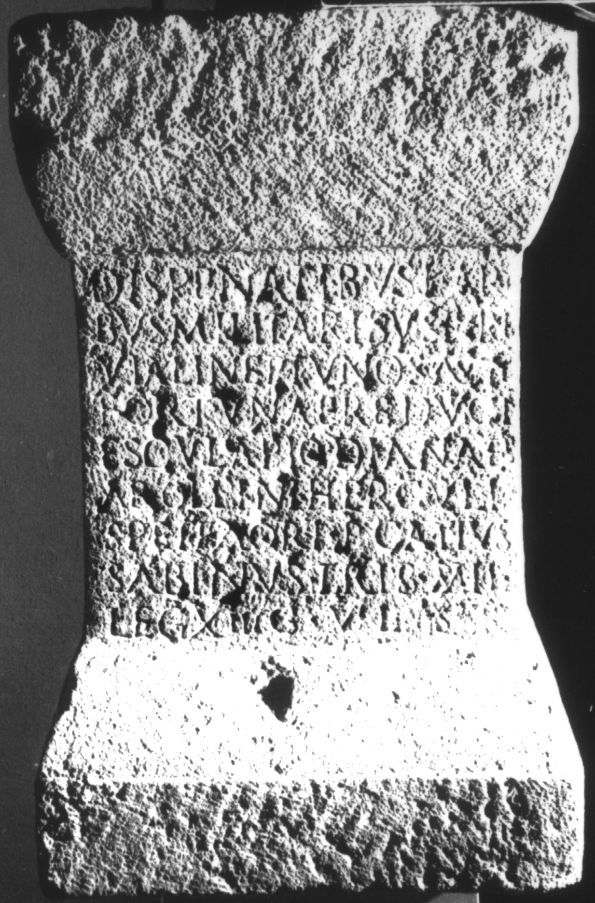
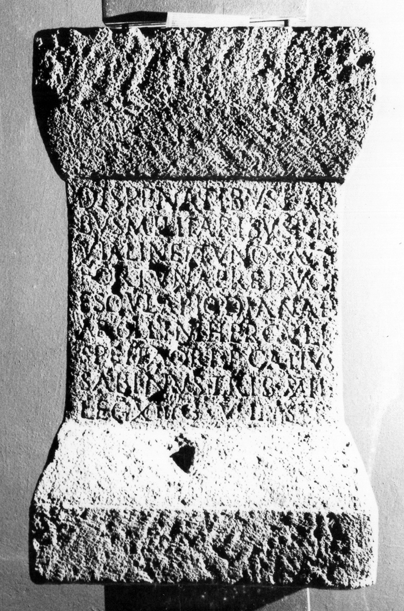

# EDH HD018876. Apulum

**Країна.** Румунія

**Провінція (код EDH).** Dac

**Місце знахідки (антична назва).** Apulum

**Сучасна назва.** Alba Iulia

**Деталі знахідки.** {Festung}

**Координати.** 46.068288248,23.571209907

**Зберігання.** Alba Iulia, Muz. Unirii

**Датування (роки, від'ємні до н. е.).** 193 … 199

**Матеріал.** Kalkstein

**Тип пам'ятки.** Statuenbasis

**Розміри (висота, ширина, глибина, см).** 78.0 × 47.0 × 36.0

## Текст (латинь, скорочення розкрито)

```
Dis Penatibus Lari/bus Militaribus Lari / Viali Neptuno Saluti / Fortunae Reduci / (A)esculapio Dianae / Apollini Herculi / Spei Fa(v)ori P(ublius) Catius / Sabinus trib(unus) mil(itum) / leg(ionis) XIII g(eminae) v(otum) l(ibens) s(olvit)
```

## Текст у вихідному записі

```
DIS PENATIBVS LARI / BVS MILITARIBVS LARI / VIALI NEPTVNO SALVTI / FORTVNAE REDVCI / ESCVLAPIO DIANAE / APOLLINI HERCVLI / SPEI FAORI P CATIVS / SABINVS TRIB MIL / LEG XIII G V L S
```

## Література

AE 1956, 0204.
- I.H. Crişan, StCercIstorV 5, 1954, 603-606; fig. 1 ( Zeichnung). - AE 1956.
- IDR 3, 5, 299; Foto u. Zeichnung. #

## Фото





Джерело https://edh.ub.uni-heidelberg.de/edh/inschrift/HD018876, ліцензія CC BY-SA 4.0. Оригінальний XML в архіві сирі_дані/edh_xml.zip
