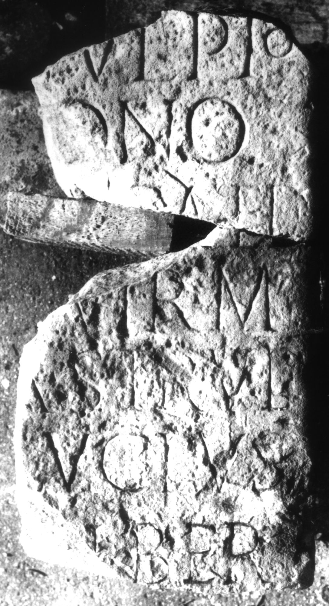
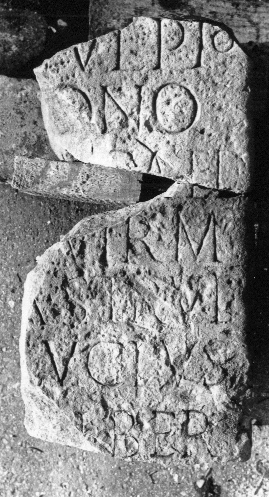

# EDH HD018882. Apulum aus?

**Країна.** Румунія

**Провінція (код EDH).** Dac

**Місце знахідки (антична назва).** Apulum aus?

**Сучасна назва.** Drajna de Sus?

**Деталі знахідки.** {Lager}?

**Координати.** 45.258070210,26.074451207

**Зберігання.** Ploieşti, Muz. Jud.

**Датування (роки, від'ємні до н. е.).** 151 … 200

**Матеріал.** Sandstein

**Тип пам'ятки.** Statuenbasis

**Розміри (висота, ширина, глибина, см).** -85.0 × -28.0 × -37.0

## Текст (латинь, скорочення розкрито)

```
M(arco) Ulpio / [B]ono / [d]ec(urioni) aed(ili) / [III]Ivir(o) m(unicipii) / A(pulensis?) STR Ul(pius) / Lucius / liber(tus)
```

## Текст у вихідному записі

```
M VLPIO / [ ]ONO / [ ]EC AED / [ ]IVIR M / A STR VL / LVCIVS / LIBER
```

## Коментар

Zwei aneinanderpassende Fragmente erhalten. (B): Florescu; AE 1956; AE 1977: Z. 1: C(aio); Z. 4/5: AE 1977: Zeilenfall fehlt; Z. 5: s(acerdoti) pr(ovinciae) Ulp(ius); Z. 5/6: AE 1977: Zeilenfall fehlt. Material: roter Sandstein.

## Література

AE 1956, 0207. (B)
- AE 1977, 0656. (B)
- IDR 3, 5, 447; Foto u. Zeichnung.
- G. Florescu, StCercIstorV 6, 1955, 331-332; fig. 1. (B) - AE 1956. 1977. #

## Фото





Джерело https://edh.ub.uni-heidelberg.de/edh/inschrift/HD018882, ліцензія CC BY-SA 4.0. Оригінальний XML в архіві сирі_дані/edh_xml.zip
