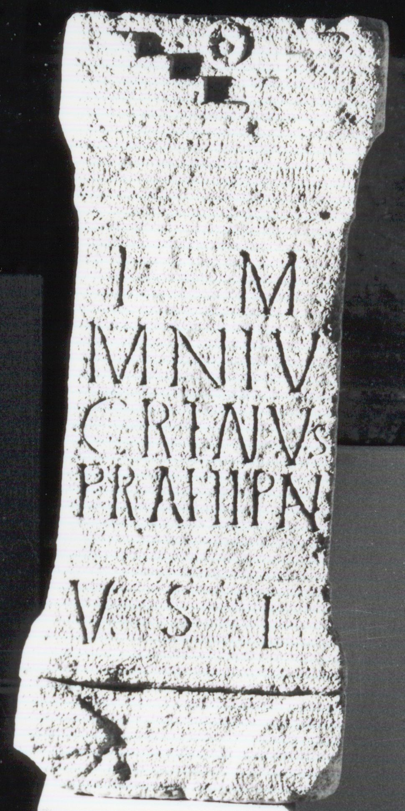

# EDH HD018934. Gherla

**Країна.** Румунія

**Провінція (код EDH).** Dac

**Сучасна назва.** Gherla

**Координати.** 47.022697379,23.896561861

**Зберігання.** Cluj-Napoca, Muz. Naţ. Ist. Transilv.

**Датування (роки, від'ємні до н. е.).** 201 … 270

**Тип пам'ятки.** Altar

**Розміри (висота, ширина, глибина, см).** 84.0 × 35.0 × 23.0

## Текст (латинь, скорочення розкрито)

```
I(ovi) O(ptimo) M(aximo) / M(---) N(---) Lu/cret(i)anus / pr(aefectus) a(la)e II Pan(noniorum) / v(otum) s(olvit) l(ibens)
```

## Текст у вихідному записі

```
I O M / M N LV / CRETANVS / PR AE II PAN / V S L
```

## Коментар

Z. 5 befindet sich auf der crepido. (B): AE 1891; Ornstein; CIL 03, 12540; AE 1960: Abweichungen in der Lesung.

## Література

AE 1960, 0222. (B)
- AE 1891, 0089. (B)
- CIL 03, 12540. (B)
- ILD 587.
- J. Ornstein, AEM 14, 1891, 175, Nr. 6b. (B) - AE 1891.
- I.I. Russu, MatCercA 6, 1959, 874, Nr. 4; fig. 5 (Zeichnung). - AE 1960. #

## Фото



Джерело https://edh.ub.uni-heidelberg.de/edh/inschrift/HD018934, ліцензія CC BY-SA 4.0. Оригінальний XML в архіві сирі_дані/edh_xml.zip
