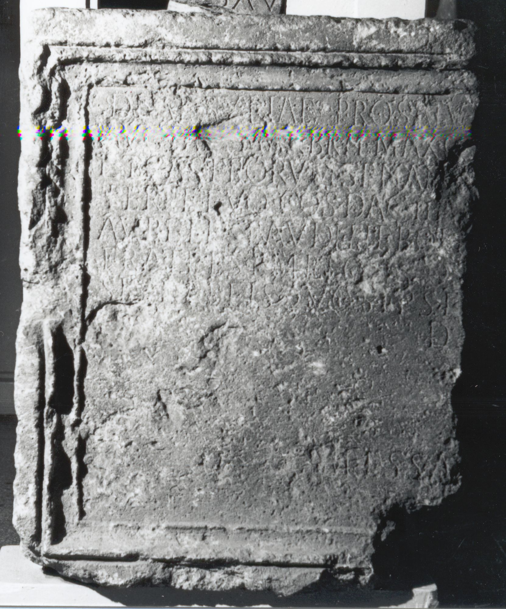
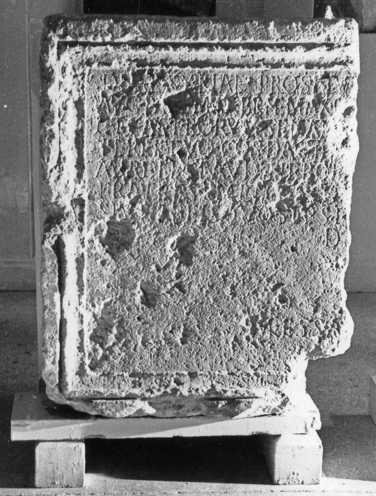

# EDH HD018946. Napoca

**Країна.** Румунія

**Провінція (код EDH).** Dac

**Місце знахідки (антична назва).** Napoca

**Сучасна назва.** Cluj-Napoca

**Деталі знахідки.** {Strada Memorandumului 6}

**Координати.** 46.770087627,23.587676658

**Зберігання.** Cluj-Napoca, Muz. Naţ. Ist. Transilv.

**Датування (роки, від'ємні до н. е.).** 214 … 

**Тип пам'ятки.** Tafel

**Розміри (висота, ширина, глибина, см).** 60.0 × -50.0 × 10.0

## Текст (латинь, скорочення розкрито)

```
Deae Syriae pro salu[te d(omini) n(ostri) Imp(eratoris) Caes(aris) M(arci) Aur(eli) Antonini Pii Fel(icis)] / Aug(usti) Pa[rt(hici)] ma[x(imi)] Brit(annici) max(imi) G[er(manici) max(imi) et Iuliae Aug(ustae) matris d(omini) n(ostri)] / et castrorum senat[usque ac patriae curante? L(ucio) Mario] / Perpetuo co(n)s(ulari) Dac(iarum) II[I ---] / Aureli Claudi Nepo[tiani? ---] / fratres empto [loc?]o [---] / sive ab eis quos ipsi [---] / d(ecreto) [d(ecurionum)?] / Messa[la et Sabino co(n)s(ulibus)]
```

## Текст у вихідному записі

```
DEAE SYRIAE PRO SALV[ ] / AVG PA[ ] MA[ ] BRIT MAX G[ ] / ET CASTRORVM SENAT[ ] / PERPETVO COS DAC II[ ] / AVRELI CLAVDI NEPO[ ] / FRATRES EMPTO [ ]O [ ] / SIVE AB EIS QVOS IPSI [ ] / D [ ] / MESSA[ ]
```

## Коментар

(B): Buday; ILD: Z. 3: [c]astrorum, Z. 7: siv[e].

## Література

AE 1960, 0226.
- ILD 542.
- PIR (2. Aufl.) O 25.
- PIR V 86.
- PIR (2. Aufl.) M 311.
- Á. Buday, DolgozatokErdNemMuz 4, 1913, 255-256; Foto. (B)
- I.I. Russu, MatCercA 6, 1959, 877-878, Nr. 8. - AE 1960. #

## Фото





Джерело https://edh.ub.uni-heidelberg.de/edh/inschrift/HD018946, ліцензія CC BY-SA 4.0. Оригінальний XML в архіві сирі_дані/edh_xml.zip
