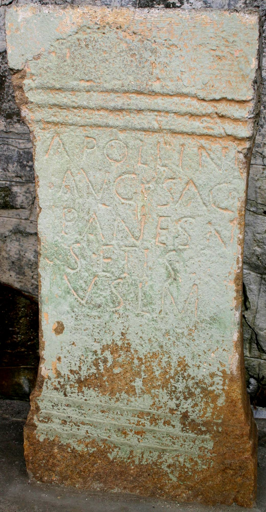

# EDH HD018976. Alburnus Maior

**Країна.** Румунія

**Провінція (код EDH).** Dac

**Місце знахідки (антична назва).** Alburnus Maior

**Сучасна назва.** Roşia Montană

**Деталі знахідки.** {Ţarina}

**Координати.** 46.306552137,23.123480928

**Рік знахідки.** 1940

**Зберігання.** Roşia Montană, Muzeul

**Датування (роки, від'ємні до н. е.).** 101 … 230

**Матеріал.** Tuff

**Тип пам'ятки.** Altar

**Розміри (висота, ширина, глибина, см).** -80.0 × -36.0 × -32.0

## Текст (латинь, скорочення розкрито)

```
Apollini / Aug(usto) sac(rum) / Panes N/[o]setis / v(otum) s(olvit) l(ibens) m(erito)
```

## Текст у вихідному записі

```
APOLLINI / AVG SAC / PANES N / [ ]SETIS / V S L M
```

## Література

AE 1960, 0236.
- IDR 3, 3, 384; fig. 279 (Foto u. Zeichnung).
- I.I. Russu, MatCercA 6, 1959, 884-885; fig. 21 (Zeichnung). - AE 1960.
- C. Ciongradi, Die römischen Steindenkmäler aus Alburnus Maior (Cluj-Napoca 2009) 64-65, Nr. 55; Taf. 27, 55. #

## Фото



Джерело https://edh.ub.uni-heidelberg.de/edh/inschrift/HD018976, ліцензія CC BY-SA 4.0. Оригінальний XML в архіві сирі_дані/edh_xml.zip
