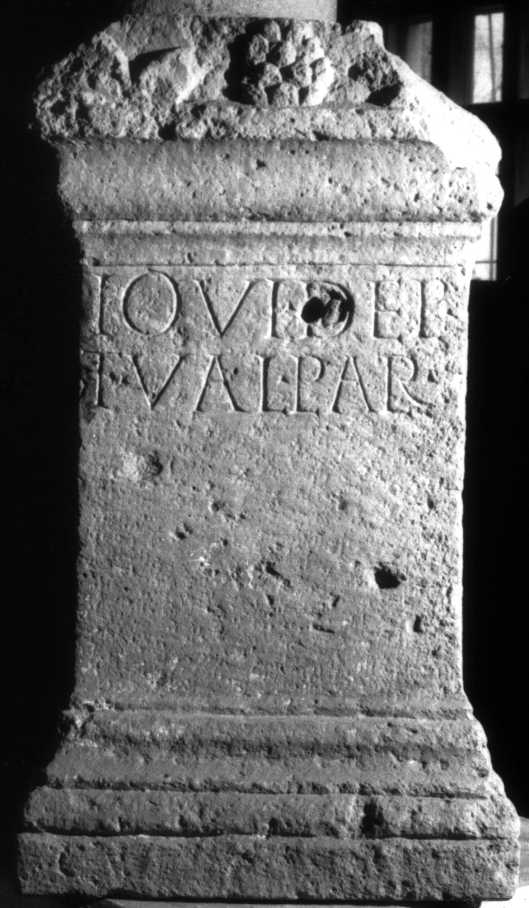

# EDH HD018985. Apulum

**Країна.** Румунія

**Провінція (код EDH).** Dac

**Місце знахідки (антична назва).** Apulum

**Сучасна назва.** Alba Iulia

**Координати.** 46.0669444,23.569999999

**Зберігання.** Cluj-Napoca, Muz. Naţ. Ist. Transilv.

**Датування (роки, від'ємні до н. е.).** 151 … 270

**Матеріал.** Kalkstein

**Тип пам'ятки.** Statuenbasis

**Розміри (висота, ширина, глибина, см).** 62.0 × 35.0 × 26.0

## Текст (латинь, скорочення розкрито)

```
Iovi Dep(u)l(sori) / T(itus) Val(erius) Plare(s)
```

## Текст у вихідному записі

```
IOVI DEPL / T VAL PLARE
```

## Література

AE 1960, 0241.
- I.I. Russu, MatCerA 6, 1959, 889-890; fig. 25. - AE 1960.
- IDR 3, 5, 110; Foto. #

## Фото



Джерело https://edh.ub.uni-heidelberg.de/edh/inschrift/HD018985, ліцензія CC BY-SA 4.0. Оригінальний XML в архіві сирі_дані/edh_xml.zip
