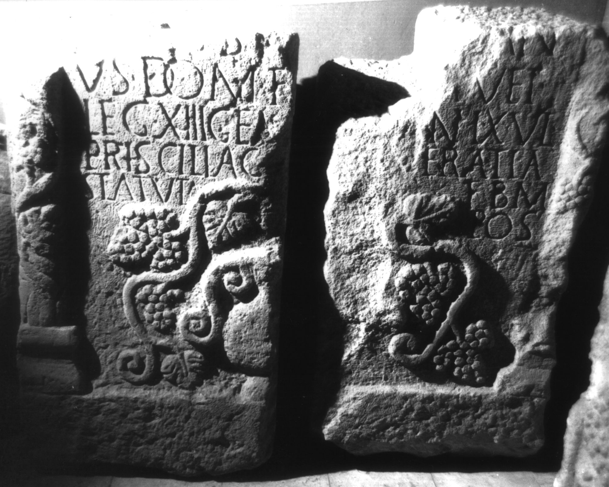

# EDH HD018994. Apulum

**Країна.** Румунія

**Провінція (код EDH).** Dac

**Місце знахідки (антична назва).** Apulum

**Сучасна назва.** Alba Iulia

**Деталі знахідки.** Tolstoi, {Strada Vasile Alecsandri} 3

**Координати.** 46.0788796,23.571799999

**Рік знахідки.** 1943

**Зберігання.** Alba Iulia, Muz. Unirii

**Датування (роки, від'ємні до н. е.).** 131 … 170

**Матеріал.** Kalkstein

**Тип пам'ятки.** Stele

**Розміри (висота, ширина, глибина, см).** -92.0 × -56.0 × 35.0

## Текст (латинь, скорочення розкрито)

```
$] / [---]I(?)us I(?)[---]an/us dom(o) F[aventi]a vet(eranus) / leg(ionis) XIII gem(inae) [vix(it) an]n(os) LX Ul(pia) / Priscilla c[o(n)iugi et] Veratia / Statuta f(ilio) b(ene) m(erenti) / pos(uerunt)
```

## Текст у вихідному записі

```
] / [ ]IVS I[ ]AN / VS DOM F[ ]A VET / LEG XIII GEM [ ]N LX VL / PRISCILLA C[ ] VERATIA / STATVTA F B M / POS
```

## Коментар

Drei Fragmente erhalten, davon die beiden unteren (b u. c) aneinanderpassend; Maße beziehen sich auf das obere Fragment (a); b: (100) x (57) x 56 cm; c: (98) x (54) x 35 cm. Oberhalb der Inschrift Medaillon mit den Büsten eines Mannes, einer Frau und eines Kindes; Inschriftfeld von Halbsäulen gerahmt; unterhalb der Inschrift Kantharos mit Trauben. Z. 1: von I(?)V und I(?) nur noch die untersten Buchstabenenden erhalten. (B): Zefleanu; Russu; AE 1960; IDR III 5; Ciongradi: Leseabweichungen.

## Література

AE 1960, 0244. (B)
- E. Zefleanu, Apulum 3, 1949, 171-173, Nr. 2; fig. 1. (B) - AE 1960.
- I.I. Russu, MatCercA 6, 1959, 891-892, Nr. 32; fig. 27 (Zeichnung). (B) - AE 1960.
- IDR 3, 5, 609; Foto u. Zeichnung. (B)
- C. Ciongradi, Grabmonument und sozialer Status in Oberdakien (Cluj-Napoca 2007) 165-166, Nr. S/A 21; Taf. 43. (B) #

## Фото



Джерело https://edh.ub.uni-heidelberg.de/edh/inschrift/HD018994, ліцензія CC BY-SA 4.0. Оригінальний XML в архіві сирі_дані/edh_xml.zip
