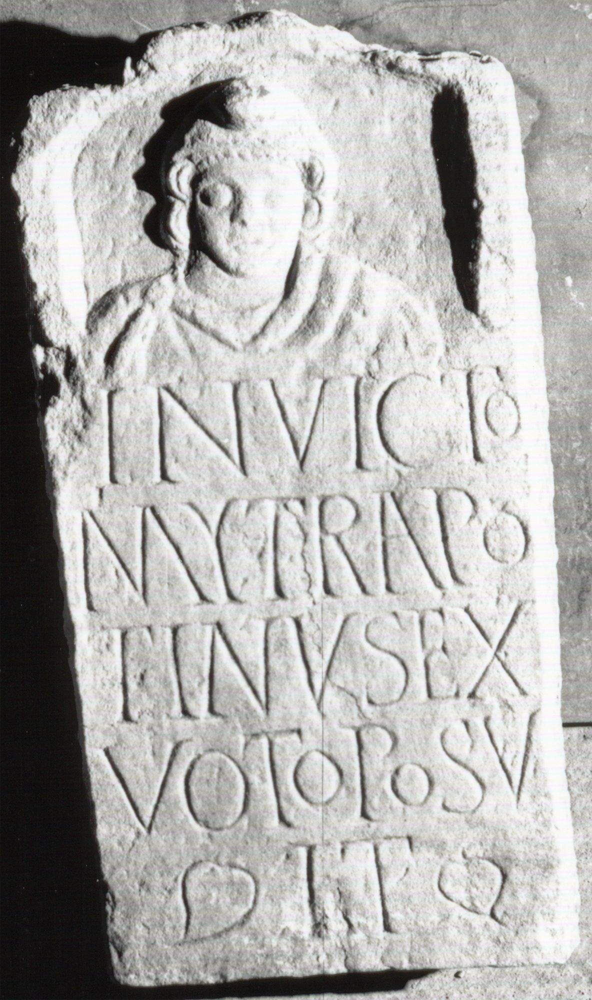

# EDH HD019120. Apulum

**Країна.** Румунія

**Провінція (код EDH).** Dac

**Місце знахідки (антична назва).** Apulum

**Сучасна назва.** Alba Iulia

**Деталі знахідки.** {Oarda de Jos}

**Координати.** 46.0187585,23.594870099

**Зберігання.** Alba Iulia, Muz. Unirii

**Датування (роки, від'ємні до н. е.).** 151 … 270

**Матеріал.** Kalkstein

**Тип пам'ятки.** Stele

**Розміри (висота, ширина, глибина, см).** 42.0 × 22.0 × 10.0

## Текст (латинь, скорочення розкрито)

```
Invicto / Myt(h)ra(e)(!) Po/tinus ex / voto posu/it
```

## Текст у вихідному записі

```
INVICTO / MYTRA PO / TINVS EX / VOTO POSV / IT
```

## Коментар

Oberhalb der Inschrift Mithrasbüste. Z. 5 (Anfang u. Ende): hederae. (B): CIMRM 2005: Z. 2: Mithra(e).

## Література

AE 1960, 0376.
- A. Popa, in: Omagiu lui Constantin Daicoviciu cu prilejul împlinirii a 60 de ani (Bucureşti 1960) 443-445; fig. 1.- AE 1960.
- IDR 3, 5, 276; Foto.
- CIMRM 2004.
- CIMRM 2005. (B) #

## Фото



Джерело https://edh.ub.uni-heidelberg.de/edh/inschrift/HD019120, ліцензія CC BY-SA 4.0. Оригінальний XML в архіві сирі_дані/edh_xml.zip
