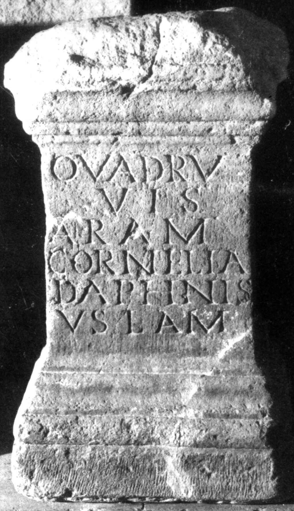

# EDH HD019334. Apulum

**Країна.** Румунія

**Провінція (код EDH).** Dac

**Місце знахідки (антична назва).** Apulum

**Сучасна назва.** Alba Iulia

**Деталі знахідки.** {Partoş}

**Координати.** 46.0463184,23.566650100

**Зберігання.** Alba Iulia, Muz. Unirii

**Датування (роки, від'ємні до н. е.).** 107 … 200

**Матеріал.** Kalkstein

**Тип пам'ятки.** Altar

**Розміри (висота, ширина, глибина, см).** -78.0 × 35.0 × 27.0

## Текст (латинь, скорочення розкрито)

```
<Q=O>uadru/vis#<Q>uadru/vis#OUADRUVIS / aram / Cornelia / Daphnis / v(otum) s(olvit) l(ibens) a(nimo) m(eritoque?)
```

## Текст у вихідному записі

```
OVADRV / VIS / ARAM / CORNELIA / DAPHNIS / V S L A M
```

## Література

AE 1947, 0024.
- E. Zefleanu, Apulum 2, 1943-1945, 99-100; fig. 4. - AE 1947.
- IDR 3, 5, 309; Foto. #

## Фото



Джерело https://edh.ub.uni-heidelberg.de/edh/inschrift/HD019334, ліцензія CC BY-SA 4.0. Оригінальний XML в архіві сирі_дані/edh_xml.zip
