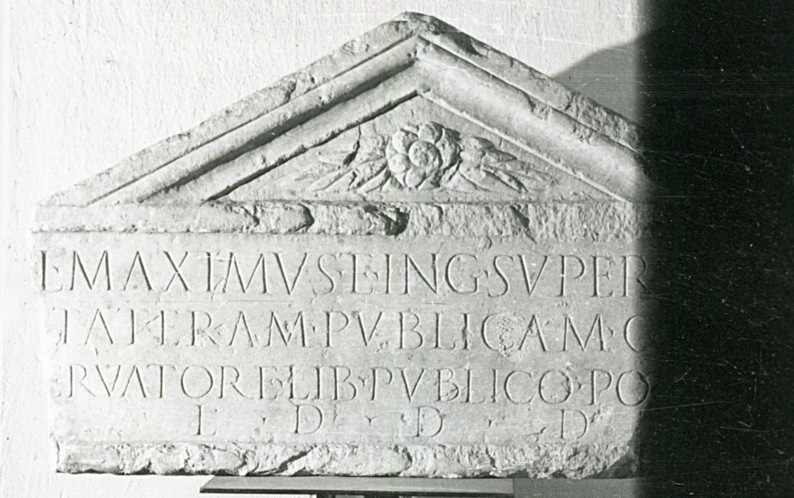

# EDH HD019510. Colonia Ulpia Traiana Sarmizegetusa, aus

**Країна.** Румунія

**Провінція (код EDH).** Dac

**Місце знахідки (антична назва).** Colonia Ulpia Traiana Sarmizegetusa, aus

**Сучасна назва.** Haţeg

**Деталі знахідки.** {Nalaţvad}, orthodoxe Kirche

**Координати.** 45.5914018,22.934359599

**Зберігання.** Deva, Muz. Civil. Dac. şi Rom.

**Датування (роки, від'ємні до н. е.).** 131 … 200

**Тип пам'ятки.** Architekturteil

**Розміри (висота, ширина, глибина, см).** 48.0 × -75.0 × 18.0

## Текст (латинь, скорочення розкрито)

```
Cl(audius) Maximus et Ing(enuius?) Superst[es] / [s]tateram publicam cu[m] / [s]ervatore lib(erto) publico po[suer(unt)] / l(ocus) d(atus) d(ecreto) d(ecurionum)
```

## Текст у вихідному записі

```
CL MAXIMVS ET ING SVPERST[ ] / [ ]TATERAM PVBLICAM CV[ ] / [ ]ERVATORE LIB PVBLICO PO[ ] / L D D D
```

## Коментар

Inschriftfeld von einem Giebel bekrönt; wahrscheinlich handelt sich es um den oberen Abschluß eines Ständers für eine Waage. (B): Tudor; AE 1959; IDR III 2: Leseabweichungen.

## Література

AE 1999, 1289.
- AE 1959, 0302. (B)
- IDR 3, 2, 014; fig. 11 (Foto u. Zeichnung). (B)
- D. Tudor, Istoria sclavajului în Dacia romană (Bucureşti 1957) 248, Nr. 33. (B) - AE 1959.
- I. Piso, Sargetia 27, 1997/98, 261-262, Nr. 1; fig. 1a; fig. 1b (Zeichnung). - AE 1999. #

## Фото



Джерело https://edh.ub.uni-heidelberg.de/edh/inschrift/HD019510, ліцензія CC BY-SA 4.0. Оригінальний XML в архіві сирі_дані/edh_xml.zip
