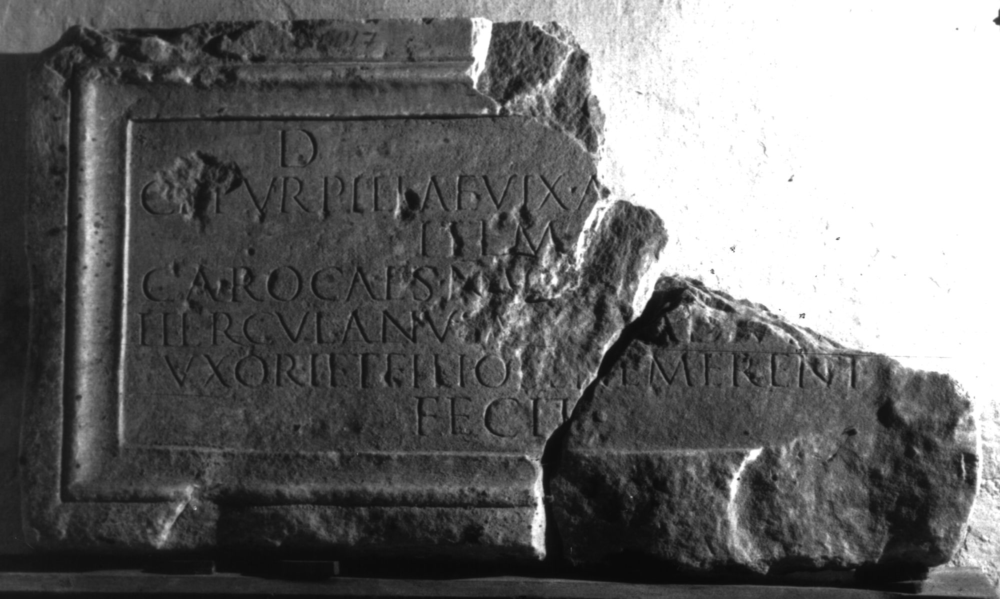

# EDH HD019513. Colonia Ulpia Traiana Sarmizegetusa

**Країна.** Румунія

**Провінція (код EDH).** Dac

**Місце знахідки (антична назва).** Colonia Ulpia Traiana Sarmizegetusa

**Сучасна назва.** Sarmizegetusa

**Деталі знахідки.** Nekropole

**Координати.** 45.516666699,22.783333299

**Зберігання.** Sarmizegetusa, Muz. Arh.

**Датування (роки, від'ємні до н. е.).** 151 … 250

**Матеріал.** Marmor

**Тип пам'ятки.** Tafel

**Розміри (висота, ширина, глибина, см).** 63.0 × 108.0 × 12.0

## Текст (латинь, скорочення розкрито)

```
D(is) [M(anibus)] / Cl(audiae) Turpillae vix(it) a[n(nos) ---] / item / Caro Caes(aris) n(ostri) ve[rnae vix(it) an(nnos) ---] / Herculanus A[ug(usti) lib(ertus)?] adiut(or) [tab(ularii)] / uxori et filio bene merent(ibus) / fecit
```

## Текст у вихідному записі

```
D [ ] / CL TVRPILLAE VIX A[ ] / ITEM / CARO CAES N VE[ ] / HERCVLANVS A[ ] ADIVT [ ] / VXORI ET FILIO BENE MERENT / FECIT
```

## Коментар

2 aneinanderpassende Fragmente erhalten. (B): Tudor; AE 1959; IDR III 2; Ciongradi: Leseabweichungen.

## Література

AE 1959, 0303. (B)
- IDR 3, 2, 402; fig. 325 (Foto u. Zeichnung). (B)
- D. Tudor, Istoria sclavajului în Dacia romană (Bucureşti 1957) 248, Nr. 34. (B) - AE 1959.
- C. Ciongradi, Grabmonument und sozialer Status in Oberdakien (Cluj-Napoca 2007) 268, Nr. T/S 10; Taf. 124. (B) #

## Фото



Джерело https://edh.ub.uni-heidelberg.de/edh/inschrift/HD019513, ліцензія CC BY-SA 4.0. Оригінальний XML в архіві сирі_дані/edh_xml.zip
