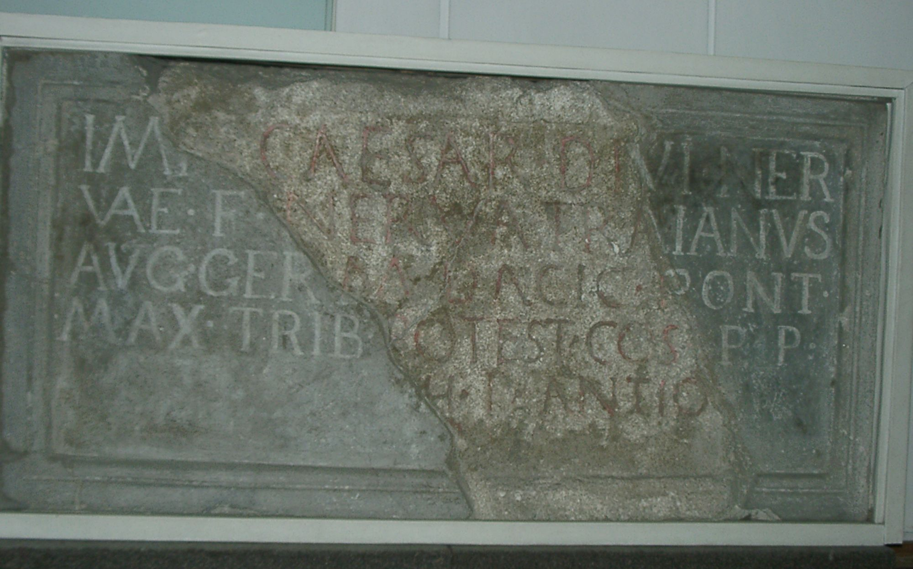

# EDH HD019531. Drobeta

**Країна.** Румунія

**Провінція (код EDH).** Dac

**Місце знахідки (антична назва).** Drobeta

**Сучасна назва.** Drobeta - Turnu Severin

**Деталі знахідки.** {Lager}

**Координати.** 44.625047680,22.668129067

**Зберігання.** Drobeta - Turnu Severin, Muz. Reg. Porţilor de Fier

**Датування (роки, від'ємні до н. е.).** 102 … 107

**Тип пам'ятки.** Tafel

**Розміри (висота, ширина, глибина, см).** 78.0 × -108.0 × 28.0

## Текст (латинь, скорочення розкрито)

```
[Imp(erator)] Caesar di[vi Ner]/[vae f(ilius)] Nerva Tra[ianus] / [Aug(ustus) Ger]m(anicus) Dacic(us) p[ont(ifex)] / [max(imus) tr(ibunicia)] potest(ate) co(n)s(ul) [p(ater) p(atriae)] / [--- per co]h(ortem) I Antio[ch(ensium)] / [------]
```

## Текст у вихідному записі

```
[ ] CAESAR DI[ ] / [ ] NERVA TRA[ ] / [ ]M DACIC P[ ] / [ ] POTEST COS [ ] / [ ]H I ANTIO[ ] / [ ]
```

## Коментар

(B): IDR II: Z. 1: Caes(ar).

## Література

AE 1959, 0309.
- IDR 2, 014; Foto u. Zeichnung. (B)
- D. Tudor, Oltenia Romanǎ (Bucureşti 1958) 379, Nr. 1. - AE 1959.
- A. Bărcăcilă, in: L'archéologie en Roumanie (Bucarest 1938) 34. 40; pl. 25, 50.
- ILD 051. #

## Фото



Джерело https://edh.ub.uni-heidelberg.de/edh/inschrift/HD019531, ліцензія CC BY-SA 4.0. Оригінальний XML в архіві сирі_дані/edh_xml.zip
