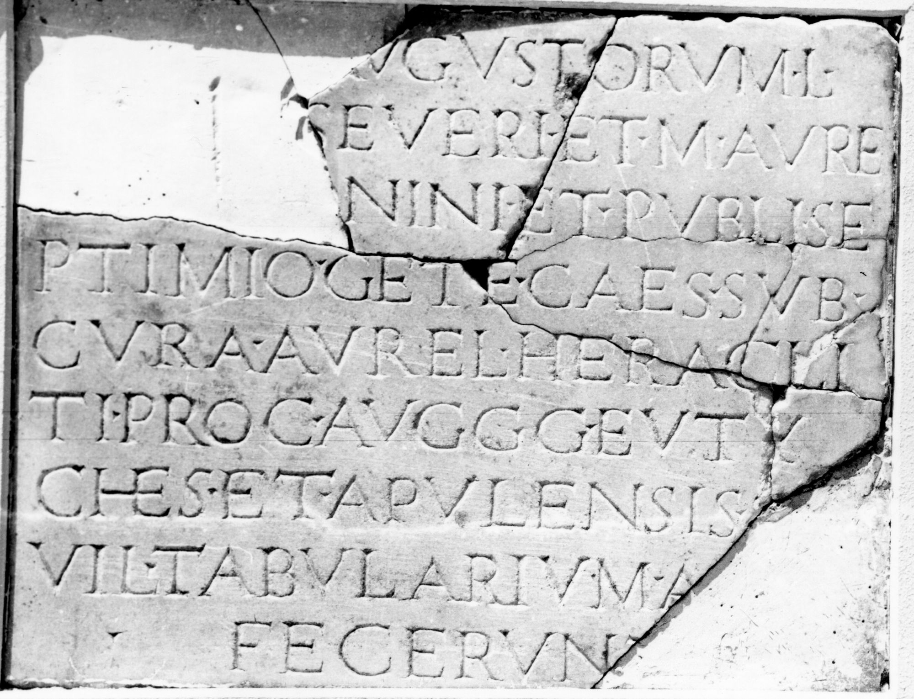
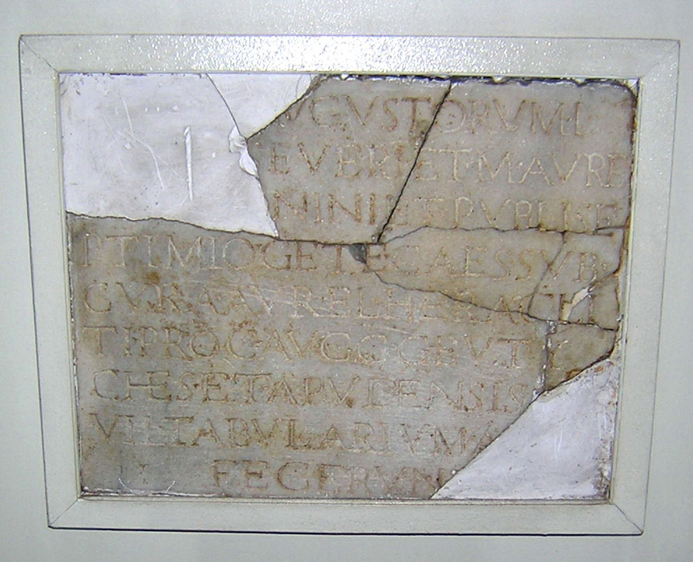

# EDH HD019534. Drobeta

**Країна.** Румунія

**Провінція (код EDH).** Dac

**Місце знахідки (антична назва).** Drobeta

**Сучасна назва.** Drobeta - Turnu Severin

**Деталі знахідки.** {Lager, Westseite}, bei

**Координати.** 44.624726970,22.667313675

**Зберігання.** Drobeta - Turnu Severin, Muz. Reg. Porţilor de Fier

**Датування (роки, від'ємні до н. е.).** 209 … 211

**Тип пам'ятки.** Tafel

**Розміри (висота, ширина, глибина, см).** 38.5 × 49.3 × 2.0

## Текст (латинь, скорочення розкрито)

```
[Pro sal(ute)] Augustorum L(uci) / [Septimi] Severi et M(arci) Aure/[li Anto]nini et Publi Se/ptimio(!) Get(a)e Caes(aris) sub / cura Aurel(i) Heracli/ti proc(uratoris) Auggg(ustorum) Euty/ches et Apulensis s[er(vi)] / vil(ici) tabularium a [solo] / fecerunt
```

## Текст у вихідному записі

```
[ ] AVGVSTORVM L / [ ] SEVERI ET M AVRE / [ ]NINI ET PVBLI SE / PTIMIO GETE CAES SVB / CVRA AVREL HERACLI / TI PROC AVGGG EVTY / CHES ET APVLENSIS S[ ] / VIL TABVLARIVM A [ ] / FECERVNT
```

## Коментар

5 aneinanderpassende Fragmente erhalten. (B): Bărcăcilă; AE 1944; Tudor; AE 1959; IDR II: Leseabweichungen. Datierung: Geta in Z, 4 wohl irrtümlich noch als Caesar bezeichnet.

## Література

AE 1959, 0310. (B)
- AE 1944, 0100.
- IDR 2, 015; Foto. (B)
- A. Bărcăcilă, in: L'archéologie en Roumanie (Bucarest 1938) 41; pl. 25, 52. (B) - AE 1944.
- D. Tudor, Oltenia Romanǎ (Bucureşti 1958) 380, Nr. 5. (B) - AE 1959. #

## Фото





Джерело https://edh.ub.uni-heidelberg.de/edh/inschrift/HD019534, ліцензія CC BY-SA 4.0. Оригінальний XML в архіві сирі_дані/edh_xml.zip
