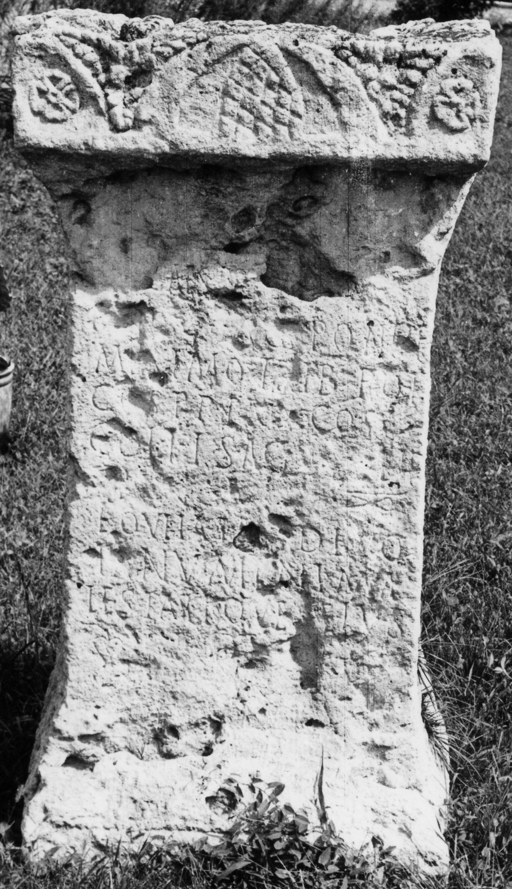

# EDH HD019537. Drobeta

**Країна.** Румунія

**Провінція (код EDH).** Dac

**Місце знахідки (антична назва).** Drobeta

**Сучасна назва.** Drobeta - Turnu Severin

**Деталі знахідки.** {Lager}

**Координати.** 44.625047680,22.668129067

**Зберігання.** Drobeta - Turnu Severin, Muz. Reg. Porţilor de Fier

**Датування (роки, від'ємні до н. е.).** 244 … 249

**Тип пам'ятки.** Statuenbasis

**Розміри (висота, ширина, глибина, см).** 167.0 × 75.0 × 50.0

## Текст (латинь, скорочення розкрито)

```
[Imp(eratori)] Caes(ari) [[[M(arco) Iul(io)]]] / [[[Philippo]]] Aug(usto) pontif(ici) / maximo trib(unicia) pot(estate) / co(n)s(uli) p(atri) p(atriae) proco(n)s(uli) / coh(ors) I sag(ittariorum) [[[Philip]]]/[[[piana]]] |(miliaria) / equitata devo/ta numini ma/iestatique eius
```

## Текст у вихідному записі

```
[ ] CAES [[[ ]]] / [[[ ]]] AVG PONTIF / MAXIMO TRIB POT / COS P P PROCOS / COH I SAG [[[ ]]] / [[[ ]]] | / EQVITATA DEVO / TA NVMINI MA / IESTATIQVE EIVS
```

## Коментар

Unterhalb der letzten Zeile 2 hederae. Zuordnung zu Philippus Arabs wahrscheinlich, aber nicht gesichert. Ergänzungen nach IDR.

## Література

AE 1959, 0311.
- AE 1944, 0101.
- IDR 2, 010; Foto u. Zeichnung.
- D. Tudor, Oltenia Romanǎ (Bucureşti 1958) 380-381, Nr. 7. - AE 1959.
- A. Bărcăcilă, in: L'archéologie en Roumanie (Bucarest 1938) 41; pl. 26, 53. - AE 1944.
- O. Tentea - F. Matei Popescu, ActaMusNapoca 39/40, 2002/03, 291-292.
- AE 1960, 0350.
- AE 1960, 0360a.
- A. Bărcăcilă, StCercIstorV 8, 1957, 323-329; fig. 1. - AE 1960. #

## Фото



Джерело https://edh.ub.uni-heidelberg.de/edh/inschrift/HD019537, ліцензія CC BY-SA 4.0. Оригінальний XML в архіві сирі_дані/edh_xml.zip
