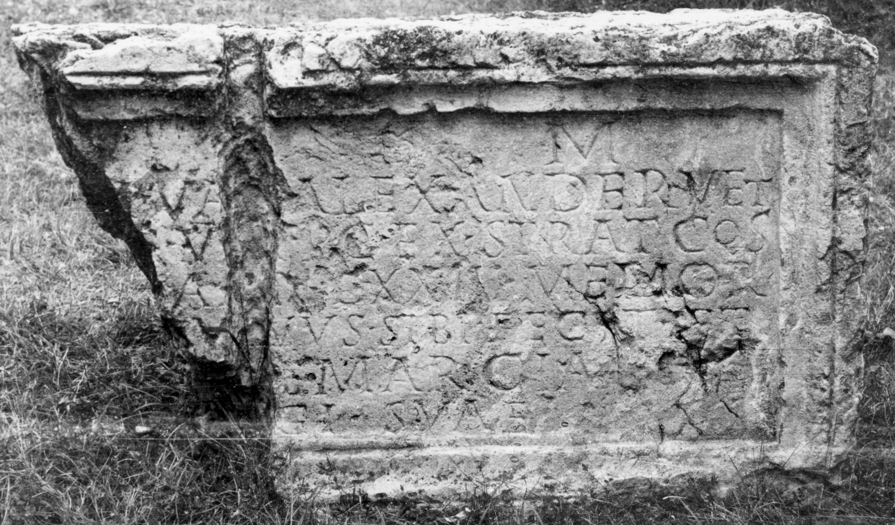

# EDH HD019546. Drobeta

**Країна.** Румунія

**Провінція (код EDH).** Dac

**Місце знахідки (антична назва).** Drobeta

**Сучасна назва.** Drobeta - Turnu Severin

**Деталі знахідки.** {Lager}, sekundär verwendet

**Координати.** 44.625047680,22.668129067

**Зберігання.** Drobeta - Turnu Severin, Muz. Reg. Porţilor de Fier

**Датування (роки, від'ємні до н. е.).** 180 … 230

**Тип пам'ятки.** Tafel

**Розміри (висота, ширина, глибина, см).** 69.0 × -112.0 × 31.0

## Текст (латинь, скорочення розкрито)

```
[D(is)] M(anibus) / [-] Va[l(erius)] Alexander vet(eranus) / [le]g(ionis) V [M(acedonicae)] p(iae) c(onstantis) ex strat(ore) co(n)s(ularis) / [vix(it)] ann(os) LXXIII memor/[iae] v[i]vus sibi fecit et / [---a]e Marcian[ae] / [coniu]gi suae
```

## Текст у вихідному записі

```
[ ] M / [ ] VA[ ] ALEXANDER VET / [ ]G V [ ] P C EX STRAT COS / [ ] ANN LXXIII MEMOR / [ ] V[ ]VVS SIBI FECIT ET / [ ]E MARCIAN[ ] / [ ]GI SVAE
```

## Коментар

2 aneinanderpassende Fragmente erhalten. Z. 1: hedera als Worttrenner. (B): Bărcăcilă: Leseabweichungen, keine Angabe von Zeilenfällen und Ergänzungen; AE 1944: unvollständige Textwiedergabe; IDR II: Leseabweichungen.

## Література

AE 1959, 0316.
- AE 1944, 0099, 3. (B)
- IDR 2, 038; Foto. (B)
- D. Tudor, Oltenia Romanǎ (Bucureşti 1958) 386-387, Nr. 36. - AE 1959.
- A. Bărcăcilă, in: L'archéologie en Roumanie (Bucarest 1938) 39; pl. 9, 16. (B) - AE 1944. #

## Фото



Джерело https://edh.ub.uni-heidelberg.de/edh/inschrift/HD019546, ліцензія CC BY-SA 4.0. Оригінальний XML в архіві сирі_дані/edh_xml.zip
