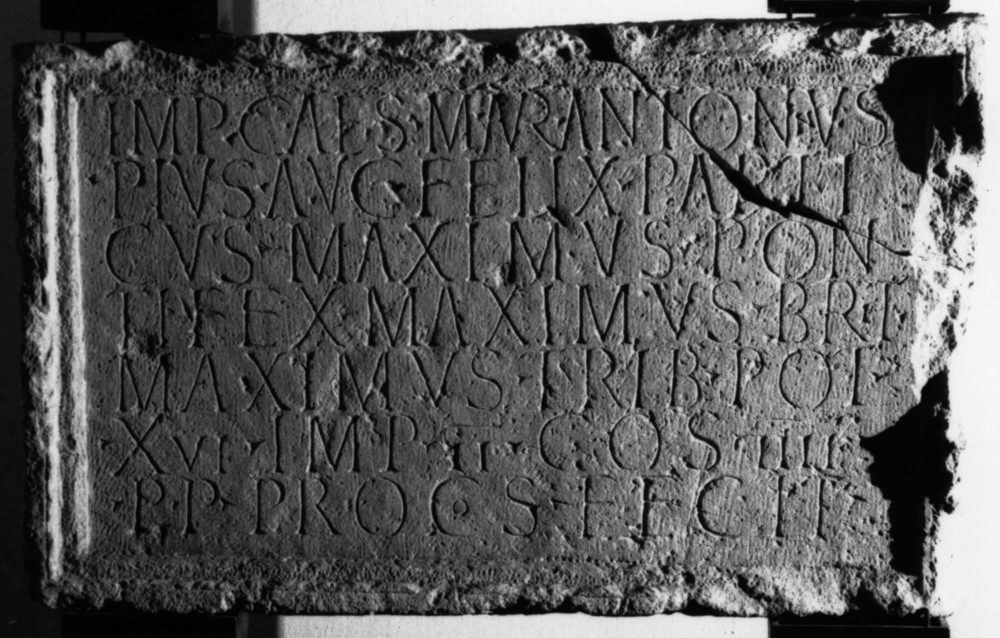

# EDH HD020014. Porolissum

**Країна.** Румунія

**Провінція (код EDH).** Dac

**Місце знахідки (антична назва).** Porolissum

**Сучасна назва.** Creaca

**Деталі знахідки.** Jac, {Lager}

**Координати.** 47.179518628,23.157656192

**Рік знахідки.** 1943

**Зберігання.** Zalău, Muz. Ist. Artă

**Датування (роки, від'ємні до н. е.).** 213 … 

**Матеріал.** Kalkstein

**Тип пам'ятки.** Block

**Розміри (висота, ширина, глибина, см).** 65.0 × 107.0 × 25.0

## Текст (латинь, скорочення розкрито)

```
Imp(erator) Caes(ar) M(arcus) Aur(elius) Antoninus / Pius Aug(ustus) Felix Part(h)i/cus maximus pon/tifex maximus Brit(annicus) / maximus trib(unicia) pot(estate) / XVI imp(erator) II co(n)s(ul) IIII / p(ater) p(atriae) proco(n)s(ul) fecit
```

## Текст у вихідному записі

```
IMP CAES M AVR ANTONINVS / PIVS AVG FELIX PARTI / CVS MAXIMVS PON / TIFEX MAXIMVS BRIT / MAXIMVS TRIB POT / XVI IMP II COS IIII / P P PROCOS FECIT
```

## Коментар

In 2 Teile gebrochen. Macrea: Zeilenfälle nicht angegeben. (B): ILD: Z. 1: Caesar.

## Література

AE 1958, 0230.
- ILD 659. (B)
- M. Macrea, StCercIstorV 8, 1957, 222-224, Nr. 1; fig. 2 (Zeichnung). - AE 1958.
- N. Gudea - V. Lucăcel, Inscripţii şi monumente sculpturale în Muzeul de Istorie şi Artă Zalău (Zalău 1975) 8-9, Nr. 2; Foto. #

## Фото



Джерело https://edh.ub.uni-heidelberg.de/edh/inschrift/HD020014, ліцензія CC BY-SA 4.0. Оригінальний XML в архіві сирі_дані/edh_xml.zip
