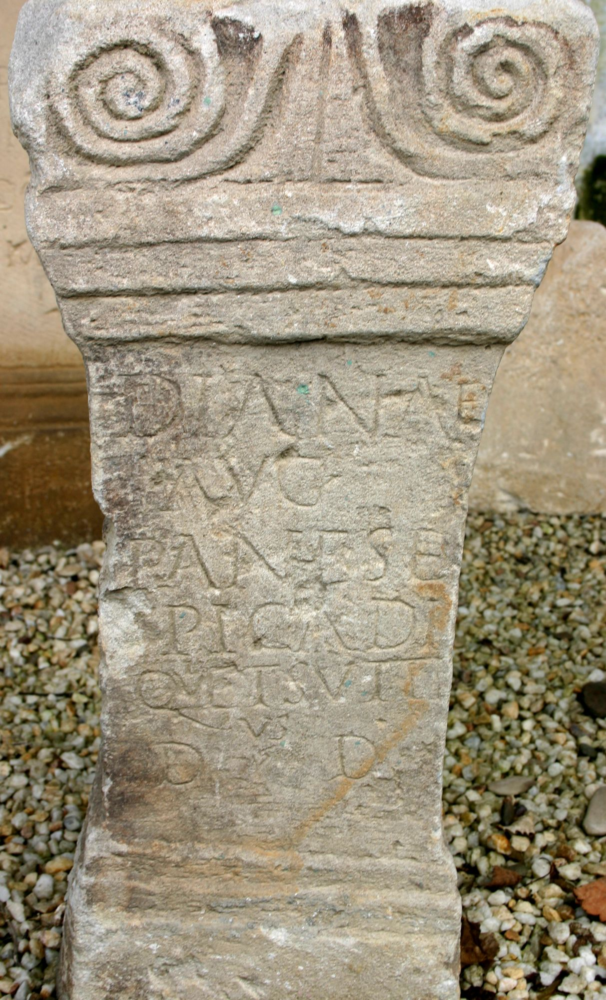
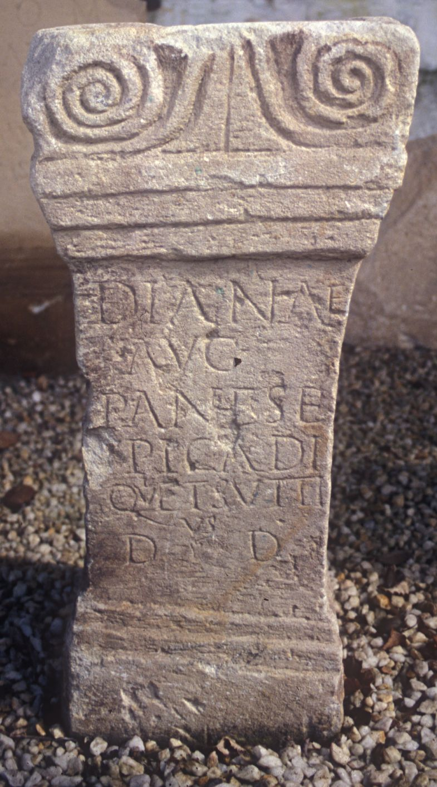

# EDH HD020247. Alburnus Maior

**Країна.** Румунія

**Провінція (код EDH).** Dac

**Місце знахідки (антична назва).** Alburnus Maior

**Сучасна назва.** Roşia Montană

**Деталі знахідки.** 12 apostoli, Bergwerk, bei

**Координати.** 46.307025,23.129894000

**Рік знахідки.** 1930

**Зберігання.** Roşia Montană, Muzeul

**Датування (роки, від'ємні до н. е.).** 171 … 200

**Матеріал.** Tuff

**Тип пам'ятки.** Altar

**Розміри (висота, ширина, глибина, см).** 67.5 × 30.0 × 22.0

## Текст (латинь, скорочення розкрито)

```
Dianae / Aug(ustae) / Panes E/picadi / qui et Sutti/us / d(ono) d(edit)
```

## Текст у вихідному записі

```
DIANAE / AVG / PANES E / PICADI / QVI ET SVTTI / VS / D D
```

## Коментар

Hedera in Z. 7. Fundjahr: 1939/37.

## Література

AE 1944, 0021.
- IDR 3, 3, 387; fig. 282 (Foto u. Zeichnung).
- C. Daicoviciu, Dacia 7/8, 1937-1940, 301, Nr. 9. - AE 1944.
- C. Ciongradi, Die römischen Steindenkmäler aus Alburnus Maior (Cluj-Napoca 2009) 52, Nr. 27; Taf. 17, 27. #

## Фото





Джерело https://edh.ub.uni-heidelberg.de/edh/inschrift/HD020247, ліцензія CC BY-SA 4.0. Оригінальний XML в архіві сирі_дані/edh_xml.zip
