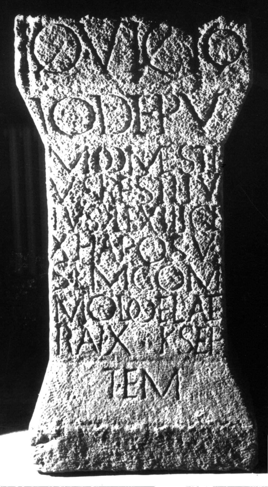

# EDH HD020259. Apulum

**Країна.** Румунія

**Провінція (код EDH).** Dac

**Місце знахідки (антична назва).** Apulum

**Сучасна назва.** Alba Iulia

**Деталі знахідки.** {ehemalige Strada Regele Ferdinand} 11

**Координати.** 46.072382115,23.577046393

**Зберігання.** Alba Iulia, Muz. Unirii

**Датування (роки, від'ємні до н. е.).** 154 … 

**Матеріал.** Kalkstein

**Тип пам'ятки.** Altar?

**Розміри (висота, ширина, глибина, см).** 107.0 × 52.0 × 41.0

## Текст (латинь, скорочення розкрито)

```
Io(vi) Victo(ri) / Io(vi) Depu(lsori) // M(arcus) Domesti/us Restitu/tus |(centurio) le(gionis) XIII ge(minae) / X ha(status) pos(terior) v(otum) / s(olvit) l(ibens) m(erito) Com/modo et Late/ran(o) X K(alendas) Sep//tem(bres)
```

## Текст у вихідному записі

```
IO VICTO / IO DEPV / / M DOMESTI / VS RESTITV / TVS | LE XIII GE / X HA POS V / S L M COM / MODO ET LATE / RAN X K SEP / / TEM
```

## Коментар

Altar oder Statuenbasis. Z. 1 u. 2 auf der corona; Z. 10 auf der crepido. (B): Daicoviciu; AE 1944: Z. 8/9: Late/ra(no) IX.

## Література

AE 1944, 0028. (B)
- C. Daicoviciu, Dacia 7/8, 1937-1940, 305; Abb. 4. (B) - AE 1944.
- IDR 3, 5, 232; Foto.
- PIR (2. Aufl.) S 666. #

## Фото



Джерело https://edh.ub.uni-heidelberg.de/edh/inschrift/HD020259, ліцензія CC BY-SA 4.0. Оригінальний XML в архіві сирі_дані/edh_xml.zip
