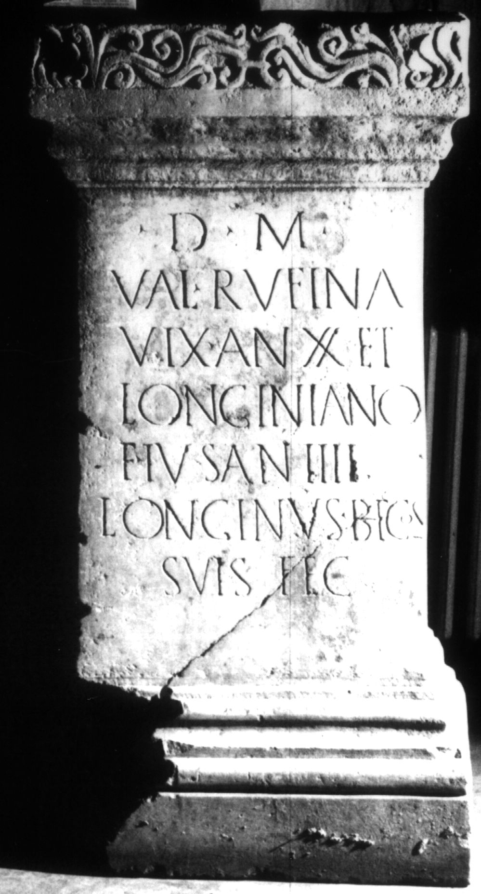

# EDH HD020274. Apulum

**Країна.** Румунія

**Провінція (код EDH).** Dac

**Місце знахідки (антична назва).** Apulum

**Сучасна назва.** Alba Iulia

**Деталі знахідки.** {Platoul Romanilor}

**Координати.** 46.0724587,23.556527400

**Рік знахідки.** 1932

**Зберігання.** Alba Iulia, Muz. Unirii

**Датування (роки, від'ємні до н. е.).** 168 … 275

**Матеріал.** Marmor, weiß

**Тип пам'ятки.** Basis

**Розміри (висота, ширина, глибина, см).** 120.0 × 59.0 × 43.5

## Текст (латинь, скорочення розкрито)

```
D(is) M(anibus) / Val(eriae) Rufina(e) / vix(it) an(nos) XX et / Longiniano / f(ilio) <e>ius an(norum) IIII / Longinus b(ene)f(iciarius) co(n)s(ularis) / suis fec(it)
```

## Текст у вихідному записі

```
D M / VAL RVFINA / VIX AN XX ET / LONGINIANO / F IVS AN IIII / LONGINVS BF COS / SVIS FEC
```

## Коментар

Altar oder Statuenbasis, auf der Oberseite Dübelloch mit Gußkanal. Datierung: wegen der Bezeichnung consularis für den Statthalter Dakiens nicht vor 168 n. Chr. (B): Christescu; AE 1935: Zeilenfälle nicht angegeben; Z. 2: Rufina[e]; Z. 5: fi[li]us.

## Література

AE 1935, 0093. (B)
- AE 1944, 0033.
- V. Christescu, BMIR 61, 1933, 97. (B) - AE 1935.
- C. Daicoviciu, Dacia 7/8, 1937-1940, 307; Abb. 8. - AE 1944.
- C. Ciongradi, Grabmonument und sozialer Status in Oberdakien (Cluj-Napoca 2007) 201, Nr. A/A 3; Taf. 60.
- IDR 3, 5, 594; Foto. #

## Фото



Джерело https://edh.ub.uni-heidelberg.de/edh/inschrift/HD020274, ліцензія CC BY-SA 4.0. Оригінальний XML в архіві сирі_дані/edh_xml.zip
