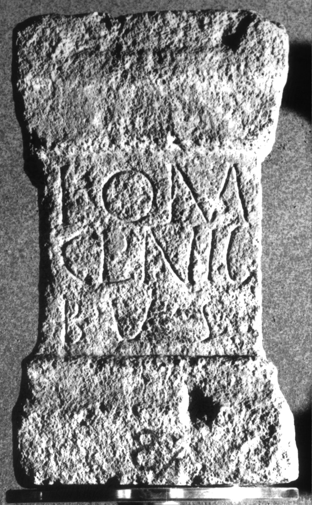

# EDH HD020283. Apulum

**Країна.** Румунія

**Провінція (код EDH).** Dac

**Місце знахідки (антична назва).** Apulum

**Сучасна назва.** Alba Iulia

**Деталі знахідки.** Carolina, {Mithraeum}

**Координати.** 46.062935988,23.567095398

**Рік знахідки.** 1930

**Зберігання.** Alba Iulia, Muz. Unirii

**Датування (роки, від'ємні до н. е.).** 201 … 270

**Матеріал.** Kalkstein

**Тип пам'ятки.** Altar

**Розміри (висота, ширина, глибина, см).** 39.0 × 23.0 × 18.0

## Текст (латинь, скорочення розкрито)

```
I(ovi) O(ptimo) M(aximo) / Cl(audius) Nic(---) / b(eneficiarius) v(otum) s(olvit)
```

## Текст у вихідному записі

```
I O M / CL NIC / B V S
```

## Коментар

AE 1960; IDR: Z. 2: Nic(ias) oder Nic(andros).

## Література

AE 1944, 0037a.
- C. Daicoviciu, Dacia 7/8, 1937-1940, 308-309, Nr. 11f. - AE 1944.
- AE 1960, 0240.
- E. Zaharia, MatCercA 6, 1959, 889, Nr. 27. - AE 1960.
- IDR 3, 5, 141; Foto. #

## Фото



Джерело https://edh.ub.uni-heidelberg.de/edh/inschrift/HD020283, ліцензія CC BY-SA 4.0. Оригінальний XML в архіві сирі_дані/edh_xml.zip
