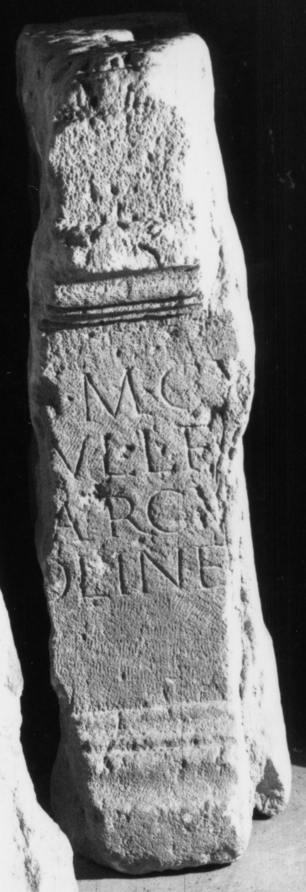

# EDH HD020289. Apulum

**Країна.** Румунія

**Провінція (код EDH).** Dac

**Місце знахідки (антична назва).** Apulum

**Сучасна назва.** Alba Iulia

**Деталі знахідки.** {Partoş}

**Координати.** 46.0463184,23.566650100

**Зберігання.** Alba Iulia, Muz. Unirii

**Датування (роки, від'ємні до н. е.).** 131 … 250

**Матеріал.** Kalkstein

**Тип пам'ятки.** Altar?

**Розміри (висота, ширина, глибина, см).** -80.0 × -17.0 × -60.0

## Текст (латинь, скорочення розкрито)

```
I(ovi) O(ptimo) M(aximo) Cu[st(odi)?] / [L(ucius) I]ul(ius) L(uci) f(ilius) C[--] / [M]arcu[s] / [-]OLINE[---]
```

## Текст у вихідному записі

```
I O M CV[ ] / [ ]VL L F C[ ] / [ ]ARCV[ ] / [ ]OLINE[ ]
```

## Коментар

Fragment eines Altars oder einer Statuenbasis. Linker und rechter Teil des urprünglich erhaltenen Inschriftfeldes heute verschollen. Z. 1: C. Daicoviciu; AE 1944: cu[stodi] oder cu[lminali]. Z. 2 (Ende): C[...](?).

## Література

AE 1944, 0037c.
- C. Daicoviciu, Dacia 7/8, 1937-1940, 309, Nr. 12. - AE 1944.
- IDR 3, 5, 214; Foto u. Zeichnung. #

## Фото



Джерело https://edh.ub.uni-heidelberg.de/edh/inschrift/HD020289, ліцензія CC BY-SA 4.0. Оригінальний XML в архіві сирі_дані/edh_xml.zip
