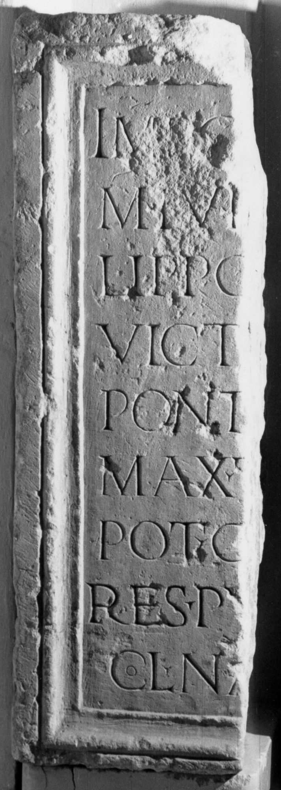

# EDH HD020295. Napoca

**Країна.** Румунія

**Провінція (код EDH).** Dac

**Місце знахідки (антична назва).** Napoca

**Сучасна назва.** Cluj-Napoca

**Координати.** 46.771741,23.576094000

**Зберігання.** Cluj-Napoca, Muz. Naţ. Ist. Transilv.

**Датування (роки, від'ємні до н. е.).** 245 … 249

**Тип пам'ятки.** Statuenbasis

**Розміри (висота, ширина, глибина, см).** 137.0

## Текст (латинь, скорочення розкрито)

```
Imp(eratori) C[aesari] / M(arco) Iul[io Phi]/lippo [P(io) F(elici) In]/vict[o Aug(usto)] / pont[ifici] / max(imo) t[rib(unicia)] / pot(estate) c[o(n)s(uli) p(atri) p(atriae)] / res pu[blica] / col(oniae) Na[poc(ensis)]
```

## Текст у вихідному записі

```
IMP C[ ] / M IVL[ ] / LIPPO [ ] / VICT[ ] / PONT[ ] / MAX T[ ] / POT C[ ] / RES PV[ ] / COL NA[ ]
```

## Коментар

Mittelteil einer Statuenbasis. (B): Daicoviciu; AE 1944; Petolescu: Abweichungen in Lesung und Ergänzung.

## Література

AE 1944, 0039. (B)
- C. Daicoviciu, Dacia 7/8, 1937-1940, 313, Nr. 1; Abb. 11. (B) - AE 1944.
- AE 2006, 1102.
- C.C. Petolescu, StCercIstorV 57, 2006, 216-217, Nr. 1117. (B) - AE 2006. #

## Фото



Джерело https://edh.ub.uni-heidelberg.de/edh/inschrift/HD020295, ліцензія CC BY-SA 4.0. Оригінальний XML в архіві сирі_дані/edh_xml.zip
