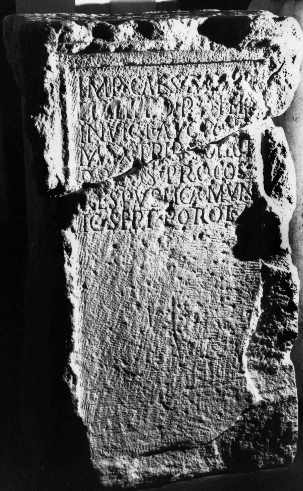
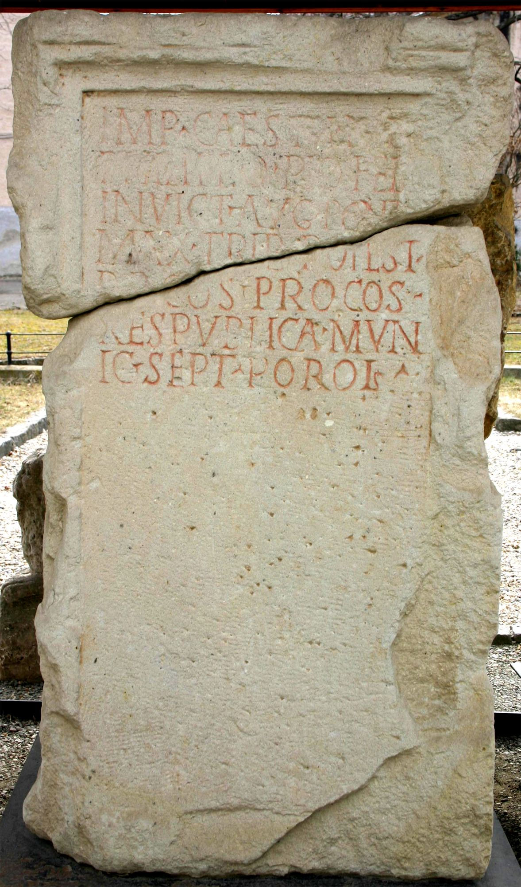
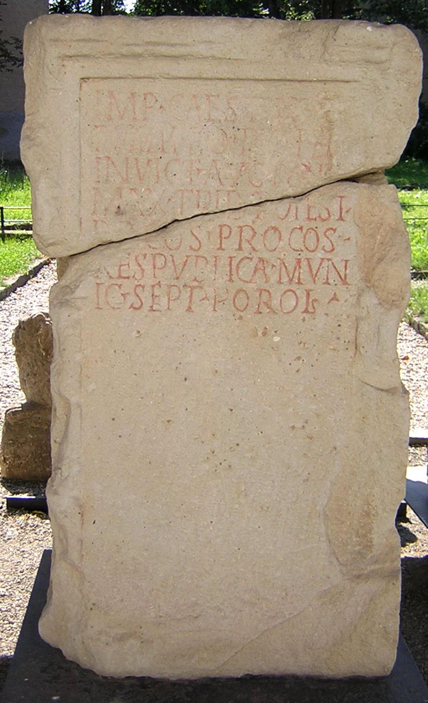

# EDH HD020337. Porolissum

**Країна.** Румунія

**Провінція (код EDH).** Dac

**Місце знахідки (антична назва).** Porolissum

**Сучасна назва.** Creaca

**Деталі знахідки.** Jac, {Lager, südwestliche Mauer}, sekundär verwendet

**Координати.** 47.178081998,23.156132695

**Рік знахідки.** 1934

**Зберігання.** Zalău, Muz. Ist. Artă

**Датування (роки, від'ємні до н. е.).** 245 … 246

**Матеріал.** Kalkstein

**Тип пам'ятки.** Statuenbasis

**Розміри (висота, ширина, глибина, см).** 122.0 × 70.0 × 46.0

## Текст (латинь, скорочення розкрито)

```
Imp(eratori) Caes(ari) [[M(arco) Iul(io)]] / [[Philippo]] Pio Fel(ici) / Invict(o) Aug(usto) pont(ifici) / max(imo) trib(unicia) potest(ate) / p(atri) p(atriae) co(n)s(uli) proco(n)s(uli) / res publica mun/ic(ipii) Sept(imi) Porol(issensium)
```

## Текст у вихідному записі

```
IMP CAES [[M IVL]] / [[PHILIPPO]] PIO FEL / INVICT AVG PONT / MAX TRIB POTEST / P P COS PROCOS / RES PVBLICA MVN / IC SEPT POROL
```

## Коментар

Mittelteil einer Statuenbasis. (B): Daicoviciu; AE 1994; ILD: Z. 3: pontif.

## Література

AE 1944, 0052. (B)
- ILD 669. (B)
- N. Gudea - V. Lucăcel, Inscripţii şi monumente sculpturale în Muzeul de Istorie şi Artă Zalău (Zalău 1975) 13, Nr. 10; Foto.
- C. Daicoviciu, Dacia 7/8, 1937-1940, 326-327, Nr. 7b. (B) - AE 1944. #

## Фото







Джерело https://edh.ub.uni-heidelberg.de/edh/inschrift/HD020337, ліцензія CC BY-SA 4.0. Оригінальний XML в архіві сирі_дані/edh_xml.zip
