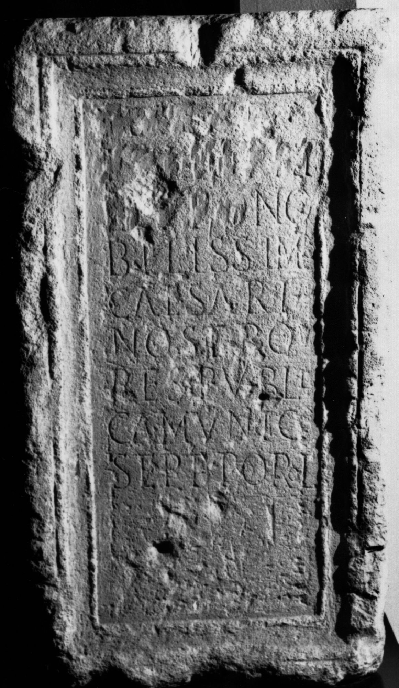

# EDH HD020340. Porolissum

**Країна.** Румунія

**Провінція (код EDH).** Dac

**Місце знахідки (антична назва).** Porolissum

**Сучасна назва.** Creaca

**Деталі знахідки.** Jac, {Lager, südwestliche Mauer}, sekundär verwendet

**Координати.** 47.178081998,23.156132695

**Рік знахідки.** 1934

**Зберігання.** Zalău, Muz. Ist. Artă

**Датування (роки, від'ємні до н. е.).** 244 … 247

**Матеріал.** Kalkstein

**Тип пам'ятки.** Statuenbasis

**Розміри (висота, ширина, глибина, см).** 122.0 × 68.0 × 44.0

## Текст (латинь, скорочення розкрито)

```
[[M(arco) Iul(io) Se]]/[[vero Phi]]/[[lippo]] no/bilissimo / Caesari / nostro / res publi/ca munic(ipii) / Sept(imii) Porol(issensium)
```

## Текст у вихідному записі

```
[[M IVL SE]] / [[VERO PHI]] / [[LIPPO]] NO / BILISSIMO / CAESARI / NOSTRO / RES PVBLI / CA MVNIC / SEPT POROL
```

## Коментар

Mittelteil einer Statuenbasis. (B): Gudea - Lucăcel; ILD: Leseabweichungen.

## Література

AE 1944, 0053. (B)
- ILD 670. (B)
- N. Gudea - V. Lucăcel, Inscripţii şi monumente sculpturale în Muzeul de Istorie şi Artă Zalău (Zalău 1975) 13, Nr. 11; Foto. (B)
- C. Daicoviciu, Dacia 7/8, 1937-1940, 327, Nr. 7c. (B) - AE 1944. #

## Фото



Джерело https://edh.ub.uni-heidelberg.de/edh/inschrift/HD020340, ліцензія CC BY-SA 4.0. Оригінальний XML в архіві сирі_дані/edh_xml.zip
