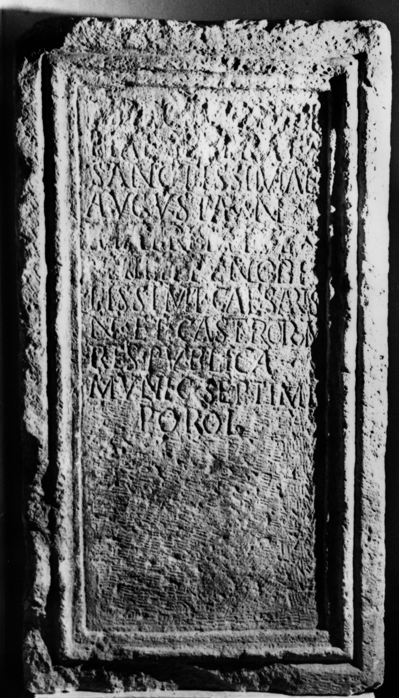
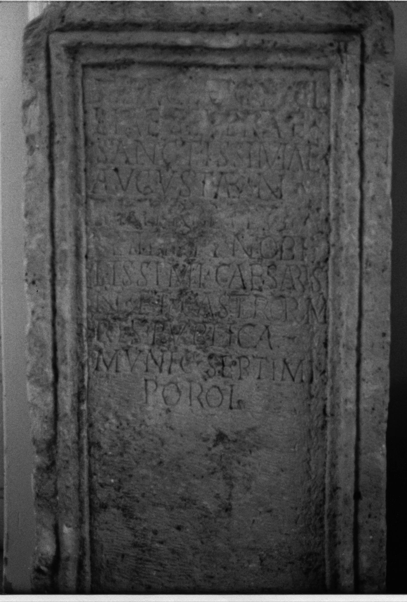

# EDH HD020343. Porolissum

**Країна.** Румунія

**Провінція (код EDH).** Dac

**Місце знахідки (антична назва).** Porolissum

**Сучасна назва.** Creaca

**Деталі знахідки.** Jac, {Lager, südwestliche Mauer}, sekundär verwendet

**Координати.** 47.178081998,23.156132695

**Рік знахідки.** 1934

**Зберігання.** Cluj-Napoca, Muz. Naţ. Ist. Transilv.

**Датування (роки, від'ємні до н. е.).** 244 … 247

**Матеріал.** Kalkstein

**Тип пам'ятки.** Statuenbasis

**Розміри (висота, ширина, глибина, см).** 122.0 × 40.0 × 48.0

## Текст (латинь, скорочення розкрито)

```
[[Marciae Otaci]]/[[liae Severae]] / sanctissimae / Augustae n(ostrae) / [[matri M(arci) Iul(i)]] / [[Philippi]] nobi/lissimi Caesaris / n(ostri) et castrorum / res publica / munic(ipii) Septimi / Porol(issensium)
```

## Текст у вихідному записі

```
[[MARCIAE OTACI]] / [[LIAE SEVERAE]] / SANCTISSIMAE / AVGVSTAE N / [[MATRI M IVL]] / [[PHILIPPI]] NOBI / LISSIMI CAESARIS / N ET CASTRORVM / RES PVBLICA / MVNIC SEPTIMI / POROL
```

## Коментар

Mittelteil einer Statuenbasis.

## Література

AE 1944, 0054.
- ILD 671.
- C. Daicoviciu, Dacia 7/8, 1937-1940, 327, Nr. 7d; Abb. 24. - AE 1944. #

## Фото





Джерело https://edh.ub.uni-heidelberg.de/edh/inschrift/HD020343, ліцензія CC BY-SA 4.0. Оригінальний XML в архіві сирі_дані/edh_xml.zip
