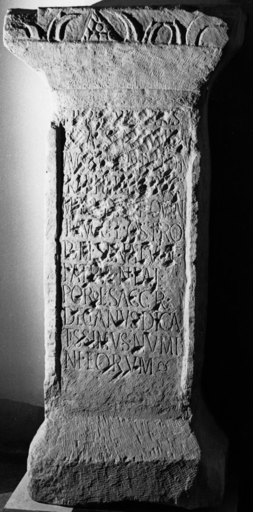
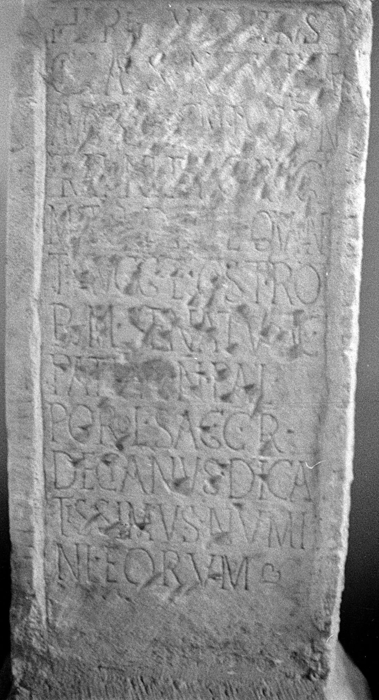
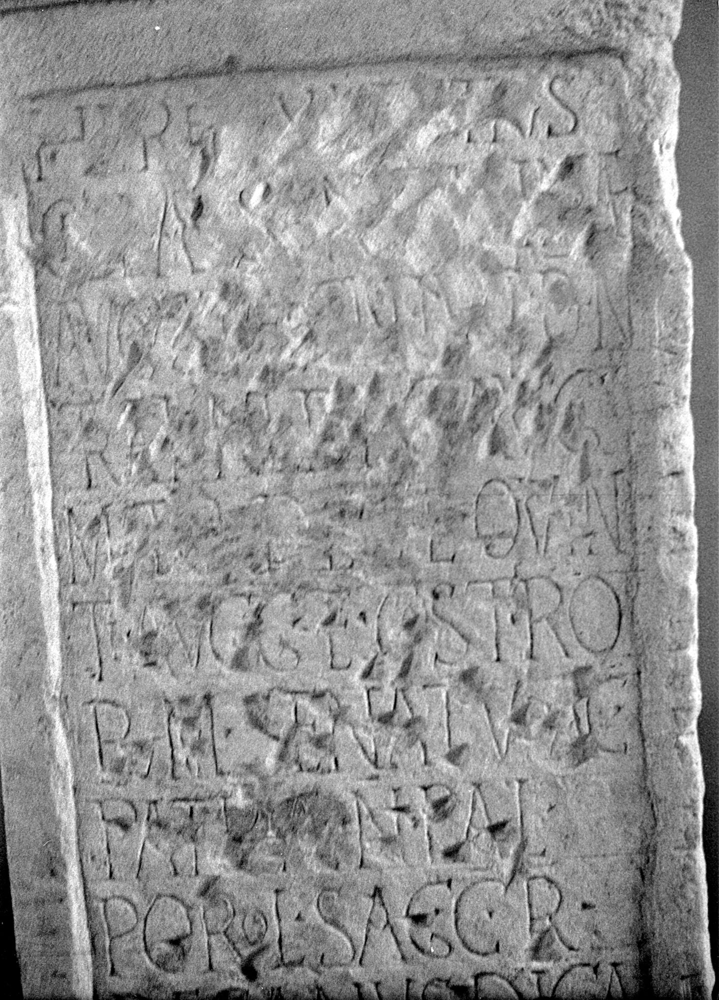

# EDH HD020349. Porolissum

**Країна.** Румунія

**Провінція (код EDH).** Dac

**Місце знахідки (антична назва).** Porolissum

**Сучасна назва.** Creaca

**Деталі знахідки.** Jac, {Lager, südwestliche Mauer}, sekundär verwendet

**Координати.** 47.178081998,23.156132695

**Рік знахідки.** 1934

**Зберігання.** Cluj-Napoca, Muz. Naţ. Ist. Transilv.

**Датування (роки, від'ємні до н. е.).** 251 … 

**Матеріал.** Kalkstein

**Тип пам'ятки.** Statuenbasis

**Розміри (висота, ширина, глибина, см).** 176.0 × 57.0 × 50.0

## Текст (латинь, скорочення розкрито)

```
[[Herenniae Etrus]]/[[cillae sanctissimae]] / [[Augustae coniugi d(omini) n(ostri)]] / [[Traiani Deci Aug(usti)]] / [[matri Deci et Quin]]/[[ti Augg(ustorum)]] et castro/rum senatus ac / patriae n(umerus) Pal(myrenorum) / Porol(issensium) sag(ittariorum) c(ivium) R(omanorum) / Decianus dica/tissimus numi/ni eorum
```

## Текст у вихідному записі

```
[[HERENNIAE ETRVS]] / [[CILLAE SANCTISSIMAE]] / [[AVGVSTAE CONIVGI D N]] / [[TRAIANI DECI AVG]] / [[MATRI DECI ET QVIN]] / [[TI AVGG]] ET CASTRO / RVM SENATVS AC / PATRIAE N PAL / POROL SAG C R / DECIANVS DICA / TISSIMVS NVMI / NI EORVM
```

## Коментар

Wegen der asymmetrischen Anordnung des Ornaments auf der corona handelt es sich offensichtlich um eine wiederverwendete Statuenbasis. Auf der Oberseite Spuren wohl von der Befestigung der Statue. Zeilenlinien für die Beschriftung; hedera am Ende der letzten Zeile. (B): ILD: Abweichungen in der Lesung.

## Література

AE 1944, 0056.
- ILD 672. (B)
- C. Daicoviciu, Dacia 7/8, 1937-1940, 328-329, Nr. 7f; Abb. 26. - AE 1944. #

## Фото







Джерело https://edh.ub.uni-heidelberg.de/edh/inschrift/HD020349, ліцензія CC BY-SA 4.0. Оригінальний XML в архіві сирі_дані/edh_xml.zip
