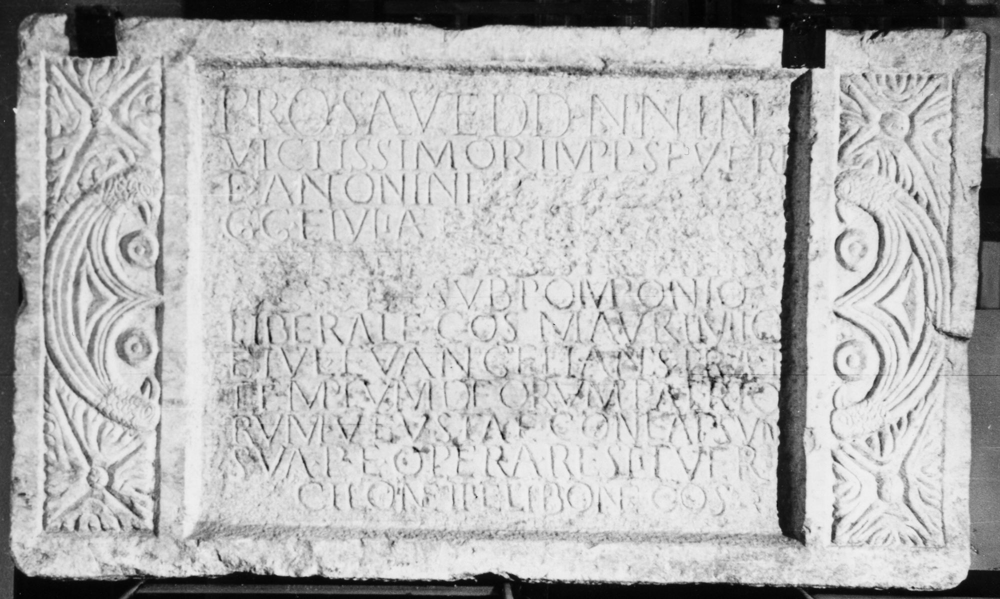

# EDH HD020403. Micia

**Країна.** Румунія

**Провінція (код EDH).** Dac

**Місце знахідки (антична назва).** Micia

**Сучасна назва.** Veţel

**Деталі знахідки.** {Tempel der Dei patrii}

**Координати.** 45.906733237,22.817702292

**Рік знахідки.** 1934

**Зберігання.** Deva, Muz. Civil. Dac. şi Rom.

**Датування (роки, від'ємні до н. е.).** 204 … 

**Тип пам'ятки.** Tafel

**Розміри (висота, ширина, глибина, см).** 59.0 × 100.0 × 17.0

## Текст (латинь, скорочення розкрито)

```
Pro salute dd(ominorum) nn(ostrorum) in/victissimor(um) Impp(eratorum) Severi / et Antonini [[et Getae Caes(aris) Aug]]/gg(ustorum)(!) et Iuliae [[et Plautillae Augg(ustarum) et]] / [[Plautiani c(larissimi) v(iri) praef(ecti) pr(aetorio) patris]] / [[Augustae]] sub Pomponio / Liberale co(n)s(ulari) Mauri Mic(ienses) / et Iul(ius) Euangelianus praef(ectus) / templum deorum patrio/rum vetustate conlapsum / sua p(ecunia) et opera restituer(unt) / Cilone II et Libone co(n)s(ulibus)
```

## Текст у вихідному записі

```
PRO SALVTE DD NN IN / VICTISSIMOR IMPP SEVERI / ET ANTONINI [[ET GETAE CAES AVG]] / GG ET IVLIAE [[ET PLAVTILLAE AVGG ET]] / [[PLAVTIANI C V PRAEF PR PATRIS]] / [[AVGVSTAE]] SVB POMPONIO / LIBERALE COS MAVRI MIC / ET IVL EVANGELIANVS PRAEF / TEMPLVM DEORVM PATRIO / RVM VETVSTATE CONLAPSVM / SVA P ET OPERA RESTITVER / CILONE II ET LIBONE COS
```

## Коментар

(B): Daicoviciu; AE 1944; IDR III: Leseabweichungen.

## Література

AE 1944, 0074. (B)
- IDR 3, 3, 047; fig. 35 (Foto u. Zeichnung). (B)
- C. Daicoviciu, Sargetia 2, 1941, 119-120, Nr. 1; fig. 1. (B) - AE 1944.
- PIR (2. Aufl.) F 554.
- PIR (2. Aufl.) P 729.
- PIR (2. Aufl.) F 27.
- PIR (2. Aufl.) A 648. #

## Фото



Джерело https://edh.ub.uni-heidelberg.de/edh/inschrift/HD020403, ліцензія CC BY-SA 4.0. Оригінальний XML в архіві сирі_дані/edh_xml.zip
