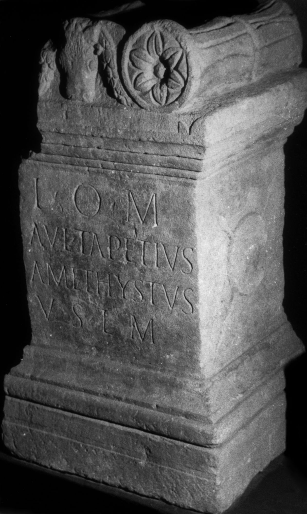
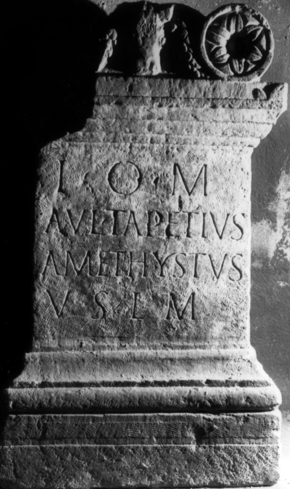

# EDH HD020497. Apulum

**Країна.** Румунія

**Провінція (код EDH).** Dac

**Місце знахідки (антична назва).** Apulum

**Сучасна назва.** Alba Iulia

**Деталі знахідки.** {Partoş}

**Координати.** 46.0463184,23.566650100

**Зберігання.** Sibiu, Muz. Brukenthal

**Датування (роки, від'ємні до н. е.).** 131 … 250

**Матеріал.** Kalkstein

**Тип пам'ятки.** Altar

**Розміри (висота, ширина, глибина, см).** 110.0 × 65.0 × 57.0

## Текст (латинь, скорочення розкрито)

```
I(ovi) O(ptimo) M(aximo) / Aul(us) Tapetius / Amethystus / v(otum) s(olvit) l(ibens) m(erito)
```

## Текст у вихідному записі

```
I O M / AVL TAPETIVS / AMETHYSTVS / V S L M
```

## Коментар

Linker oberer Teil des Altars nicht erhalten.

## Література

IDR 3, 5, 167; Foto.
- CIL 03, 06260. #

## Фото





Джерело https://edh.ub.uni-heidelberg.de/edh/inschrift/HD020497, ліцензія CC BY-SA 4.0. Оригінальний XML в архіві сирі_дані/edh_xml.zip
