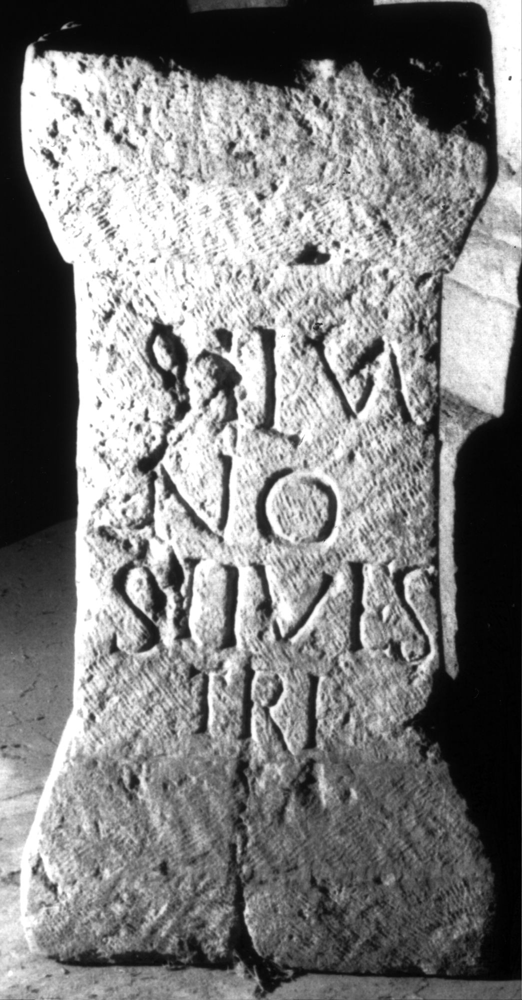

# EDH HD020509. Apulum

**Країна.** Румунія

**Провінція (код EDH).** Dac

**Місце знахідки (антична назва).** Apulum

**Сучасна назва.** Alba Iulia

**Деталі знахідки.** {Platoul Romanilor}

**Координати.** 46.0724587,23.556527400

**Зберігання.** Alba Iulia, Muz. Unirii

**Датування (роки, від'ємні до н. е.).** 107 … 275

**Матеріал.** Kalkstein

**Тип пам'ятки.** Altar?

**Розміри (висота, ширина, глибина, см).** 78.0 × 21.0 × 7.0

## Текст (латинь, скорочення розкрито)

```
Silva/no / Silves/tri
```

## Текст у вихідному записі

```
SILVA / NO / SILVES / TRI
```

## Коментар

Altar oder Statuenbasis.

## Література

AE 1977, 0659.
- IDR 3, 5, 347; Foto. #

## Фото



Джерело https://edh.ub.uni-heidelberg.de/edh/inschrift/HD020509, ліцензія CC BY-SA 4.0. Оригінальний XML в архіві сирі_дані/edh_xml.zip
