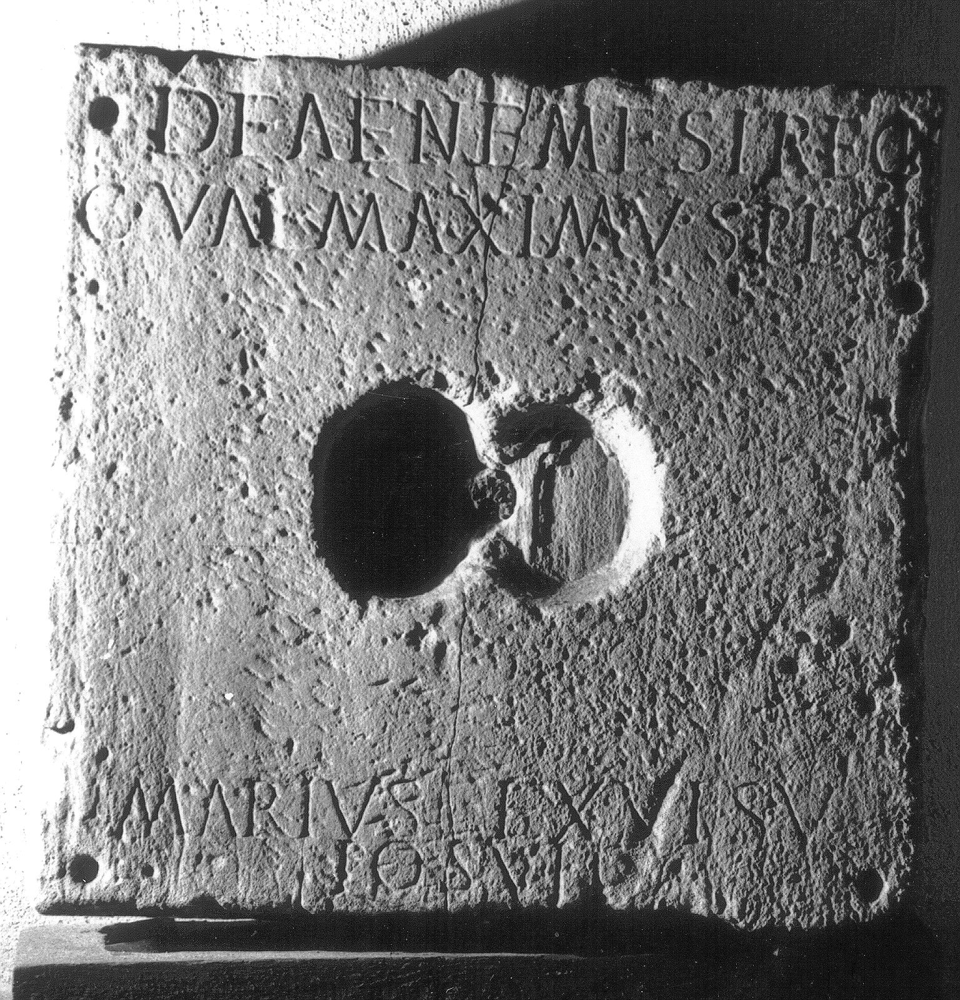

# EDH HD020524. Colonia Ulpia Traiana Sarmizegetusa

**Країна.** Румунія

**Провінція (код EDH).** Dac

**Місце знахідки (антична назва).** Colonia Ulpia Traiana Sarmizegetusa

**Сучасна назва.** Sarmizegetusa

**Деталі знахідки.** {Amphitheater}

**Координати.** 45.516685035,22.785926378

**Зберігання.** Sarmizegetusa, Muz. Arh.

**Датування (роки, від'ємні до н. е.).** 101 … 250

**Тип пам'ятки.** Tafel

**Розміри (висота, ширина, глибина, см).** 68.0 × 66.0 × 15.0

## Текст (латинь, скорочення розкрито)

```
Deae Nemesi Reg(inae) / C(aius) Val(erius) Maximus pec/umarius(!) ex visu / posuit
```

## Текст у вихідному записі

```
DEAE NEMESI REG / C VAL MAXIMVS PEC / VMARIVS EX VISV / POSVIT
```

## Коментар

(B): AE 1977: Z. 3/4: keine Angabe des Zeilenfalls. Z. 2/3: pec/umarius für pec/uarius.

## Література

AE 1977, 0669. (B)
- IDR 3, 2, 321; fig. 266 (Foto u. Zeichnung).
- I.I. Russu, StCercIstorV 25, 1974, 590-591, Nr. 5; fig. 5 (Zeichnung). - AE 1977. #

## Фото



Джерело https://edh.ub.uni-heidelberg.de/edh/inschrift/HD020524, ліцензія CC BY-SA 4.0. Оригінальний XML в архіві сирі_дані/edh_xml.zip
