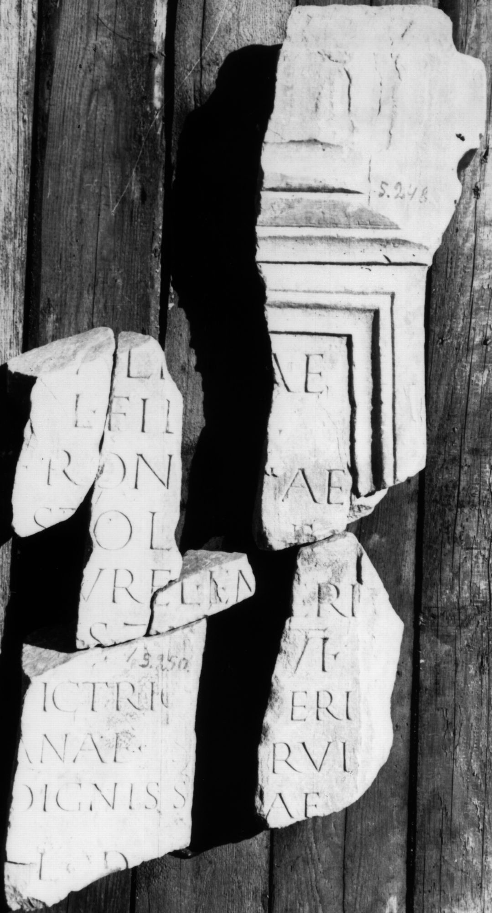

# EDH HD020527. Colonia Ulpia Traiana Sarmizegetusa

**Країна.** Румунія

**Провінція (код EDH).** Dac

**Місце знахідки (антична назва).** Colonia Ulpia Traiana Sarmizegetusa

**Сучасна назва.** Sarmizegetusa

**Координати.** 45.516666699,22.783333299

**Рік знахідки.** -1975

**Зберігання.** Sarmizegetusa, Muz. Arh.

**Датування (роки, від'ємні до н. е.).** 222 … 235

**Тип пам'ятки.** Statuenbasis?

**Розміри (висота, ширина, глибина, см).** -116.0 × -43.0 × -11.0

## Текст (латинь, скорочення розкрито)

```
[V]ale[ri]ae / L(uci) fil[iae] / Fron[tin]ae / stol[ata]e / [T(itus) A]urel(ius) Emeri/[tu]s |(centurio) l[egionis] VI / [v]ictric(is) Se[v]eri/anae s[o]crui / digniss[im]ae / l(oco) d(ato) [d(ecreto) d(ecurionum)]
```

## Текст у вихідному записі

```
[ ]ALE[ ]AE / L FIL[ ] / FRON[ ]AE / STOL[ ]E / [ ]VREL EMERI / [ ]S | L[ ] VI / [ ]ICTRIC SE[ ]ERI / ANAE S[ ]CRVI / DIGNISS[ ]AE / L D [ ]
```

## Коментар

Statuenbasis oder Altar? Mehrere aneinander passende Fragmente erhalten. (B): Bǎrbulescu, AE 1976, Petolescu, AE 1977: isolierte Wiedergabe des linken unteren Fragments mit abweichenden Ergänzungen. Textwiedergabe nach IDR.

## Література

AE 1977, 0670. (B)
- AE 1976, 0571. (B)
- IDR 3, 2, 127; fig. 101 (Zeichnung).
- M. Bǎrbulescu, Dacia 16, 1972, 205, Nr. 54; Abb. 1 (Zeichnung). (B) - AE 1976.
- C.C. Petolescu, StCercIstorV 25, 1974, 598-599, Nr. 6; fig. 3, 1; fig. 3, 2 (Zeichnung). (B) - AE 1977. #

## Фото



Джерело https://edh.ub.uni-heidelberg.de/edh/inschrift/HD020527, ліцензія CC BY-SA 4.0. Оригінальний XML в архіві сирі_дані/edh_xml.zip
