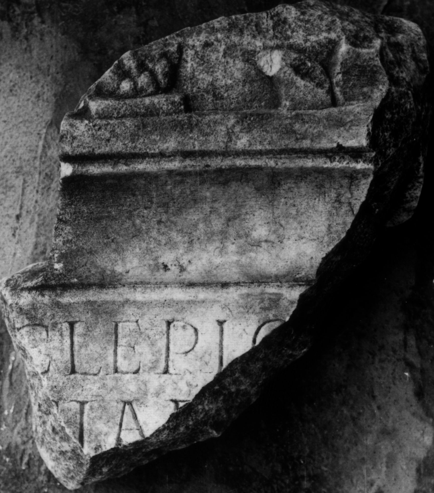
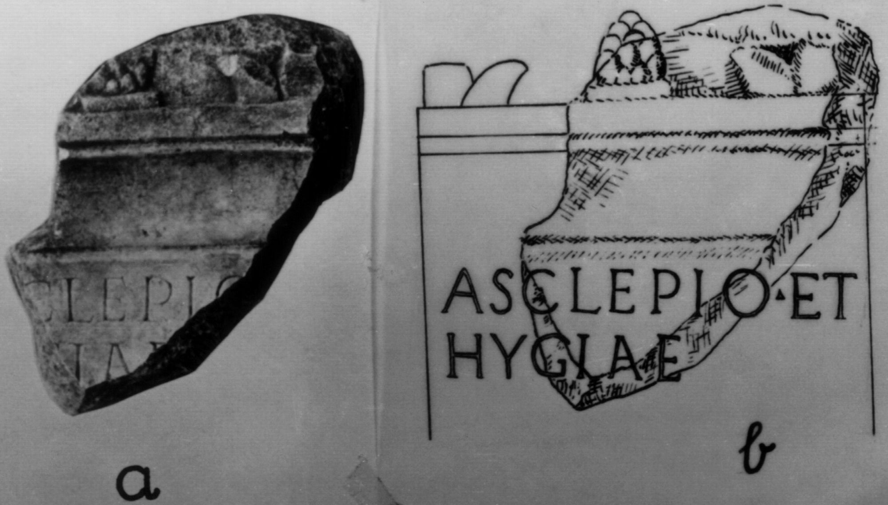
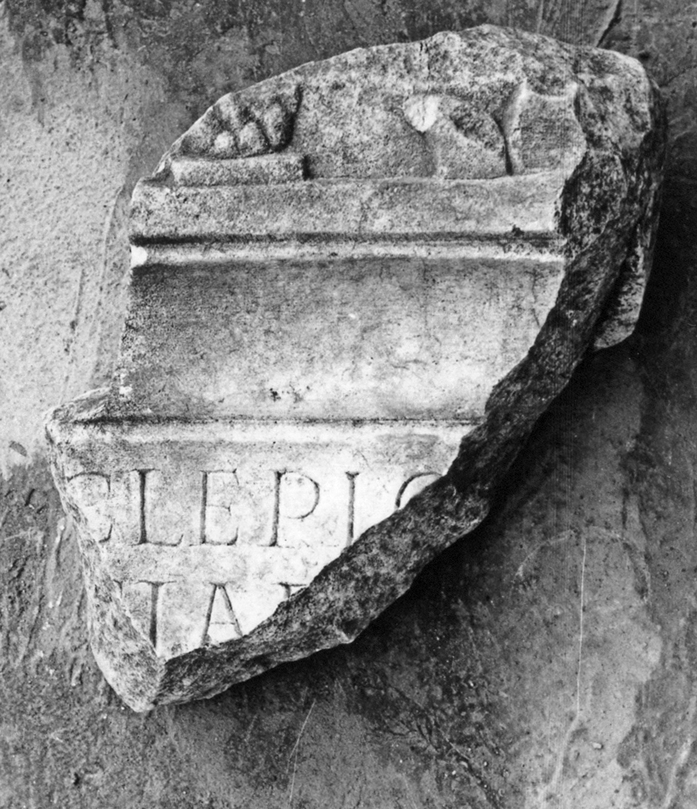

# EDH HD020554. Colonia Ulpia Traiana Sarmizegetusa

**Країна.** Румунія

**Провінція (код EDH).** Dac

**Місце знахідки (антична назва).** Colonia Ulpia Traiana Sarmizegetusa

**Сучасна назва.** Sarmizegetusa

**Деталі знахідки.** {Tempel des Aesculapius und der Hygia}

**Координати.** 45.517571787,22.788294553

**Рік знахідки.** 1973

**Зберігання.** Sarmizegetusa, Muz. Arh.

**Датування (роки, від'ємні до н. е.).** 101 … 200

**Тип пам'ятки.** Altar

**Розміри (висота, ширина, глибина, см).** -20.0 × -15.0 × -10.0

## Текст (латинь, скорочення розкрито)

```
[As]clepio [et] / [Hy]giae [&
```

## Текст у вихідному записі

```
[ ]CLEPIO [ ] / [ ]GIAE [
```

## Література

AE 1977, 0680.
- IDR 3, 2, 169; fig. 137 (Foto u. Zeichnung).
- I. Piso, Sargetia 11/12, 1974/75, 62-63, Nr. 7; fig. 7 a; fig. 7 b (Zeichnung). - AE 1977. #

## Фото







Джерело https://edh.ub.uni-heidelberg.de/edh/inschrift/HD020554, ліцензія CC BY-SA 4.0. Оригінальний XML в архіві сирі_дані/edh_xml.zip
