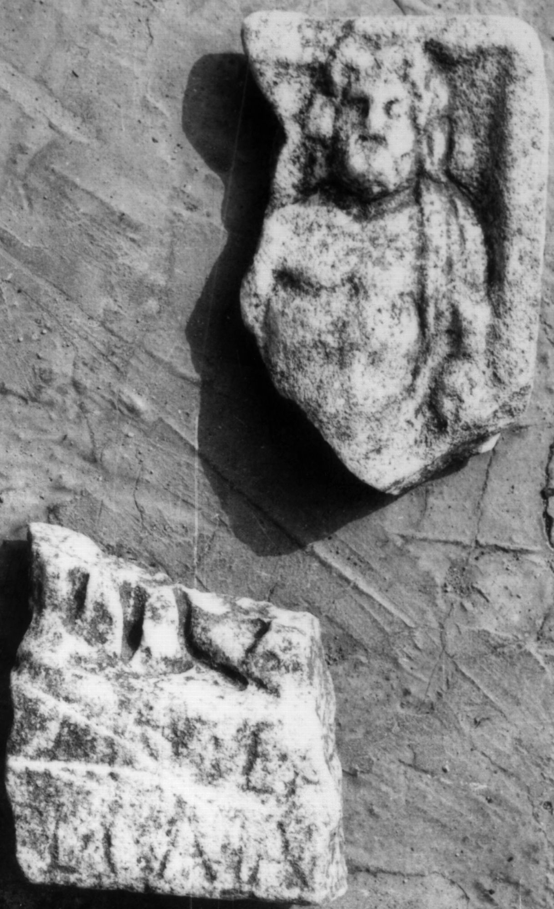
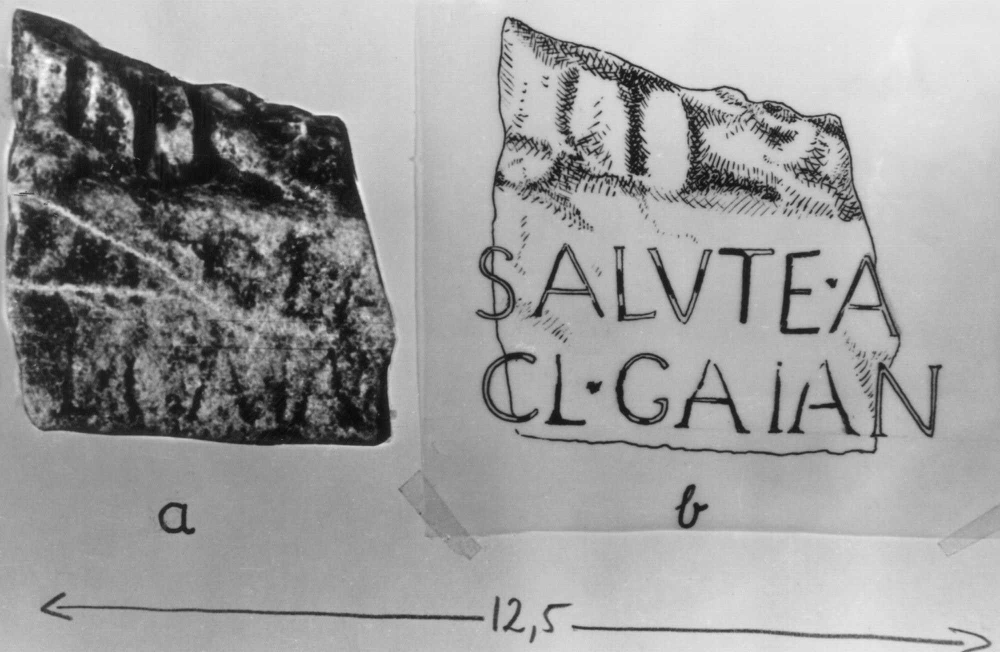
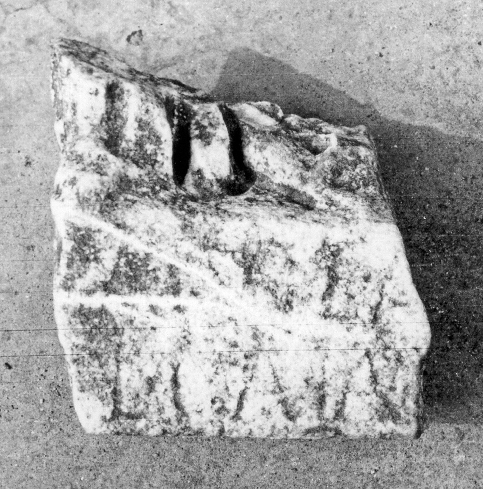
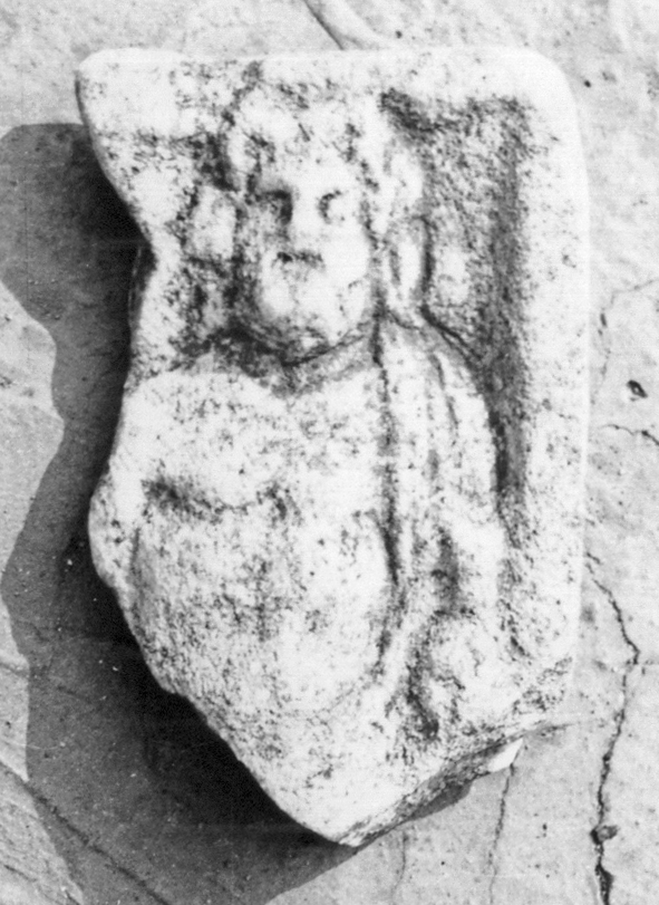

# EDH HD020557. Colonia Ulpia Traiana Sarmizegetusa

**Країна.** Румунія

**Провінція (код EDH).** Dac

**Місце знахідки (антична назва).** Colonia Ulpia Traiana Sarmizegetusa

**Сучасна назва.** Sarmizegetusa

**Деталі знахідки.** {Tempel des Aesculapius und der Hygia}

**Координати.** 45.517571787,22.788294553

**Рік знахідки.** 1973

**Зберігання.** Sarmizegetusa, Muz. Arh.

**Датування (роки, від'ємні до н. е.).** 101 … 250

**Тип пам'ятки.** Relief

**Розміри (висота, ширина, глибина, см).** -10.0 × -9.0 × -3.0

## Текст (латинь, скорочення розкрито)

```
$] / [pro] salute A[---] / [---] Cl(audius) Gaian[us?]
```

## Текст у вихідному записі

```
] / [ ] SALVTE A[ ] / [ ] CL GAIAN[ ]
```

## Література

AE 1977, 0681.
- IDR 3, 2, 160; fig. 131 (Foto u. Zeichnung).
- I. Piso, Sargetia 11/12, 1974/75, 63, Nr. 8; fig. 8 a; fig. 8 b (Zeichnung). - AE 1977. #

## Фото









Джерело https://edh.ub.uni-heidelberg.de/edh/inschrift/HD020557, ліцензія CC BY-SA 4.0. Оригінальний XML в архіві сирі_дані/edh_xml.zip
