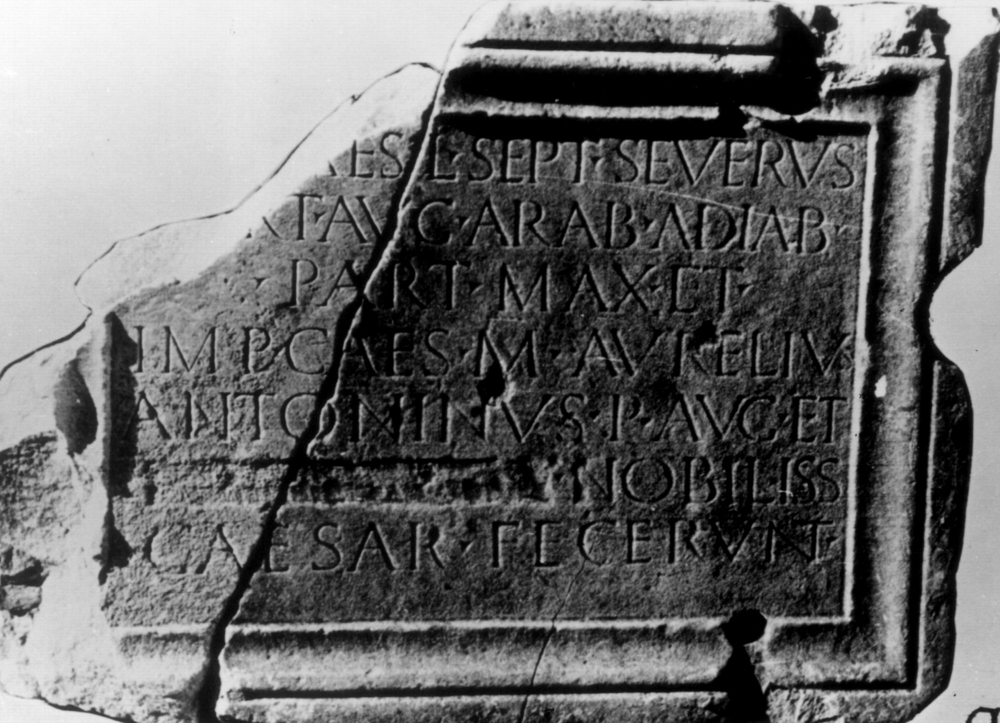
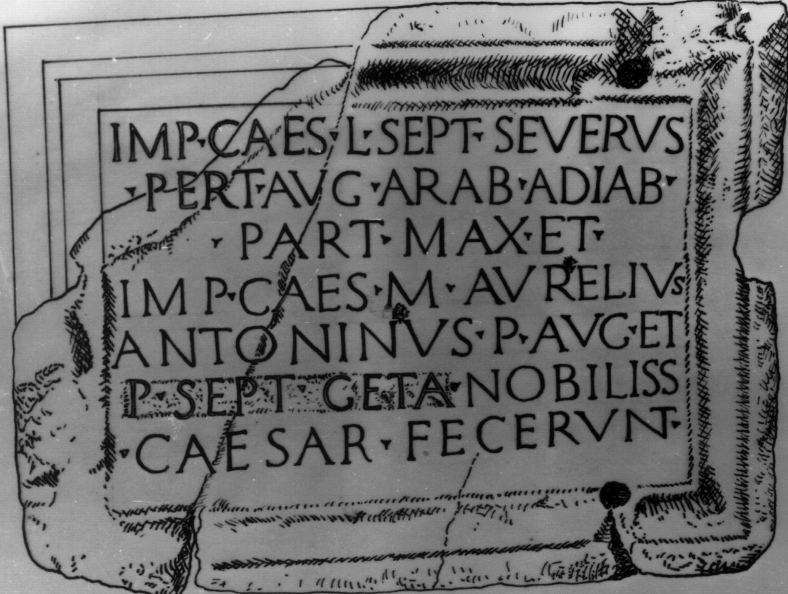

# EDH HD020560. Colonia Ulpia Traiana Sarmizegetusa, aus

**Країна.** Румунія

**Провінція (код EDH).** Dac

**Місце знахідки (антична назва).** Colonia Ulpia Traiana Sarmizegetusa, aus

**Сучасна назва.** Zam

**Деталі знахідки.** {ehemaliges Schloss Nopcsa}

**Координати.** 46.007752922,22.442268133

**Зберігання.** Deva, Muz. Civil. Dac. şi Rom.

**Датування (роки, від'ємні до н. е.).** 198 … 209

**Тип пам'ятки.** Tafel

**Розміри (висота, ширина, глибина, см).** 88.0 × 65.0 × 20.0

## Текст (латинь, скорочення розкрито)

```
[Imp(erator) C]aes(ar) L(ucius) Sept(imius) Severus / [P(ius) Pe]rt(inax) Aug(ustus) Arab(icus) Adiab(enicus) / Part(hicus) max(imus) et / Imp(erator) Caes(ar) M(arcus) Aurelius / Antoninus P(ius) Aug(ustus) et / [[P(ublius) Sept(imius) Geta]] nobiliss(imus) / Caesar fecerunt
```

## Текст у вихідному записі

```
[ ]AES L SEPT SEVERVS / [ ]RT AVG ARAB ADIAB / PART MAX ET / IMP CAES M AVRELIVS / ANTONINVS P AVG ET / [[P SEPT GETA]] NOBILISS / CAESAR FECERVNT
```

## Література

AE 1977, 0682.
- CIL 03, 01451.
- IDR 3, 2, 021; fig. 17 (Foto u. Zeichnung).
- I. Piso, Sargetia 11/12, 1974/75, 65-66, Nr. 16; fig. 16 a; fig. 16 b (Zeichnung). - AE 1977. #

## Фото





Джерело https://edh.ub.uni-heidelberg.de/edh/inschrift/HD020560, ліцензія CC BY-SA 4.0. Оригінальний XML в архіві сирі_дані/edh_xml.zip
