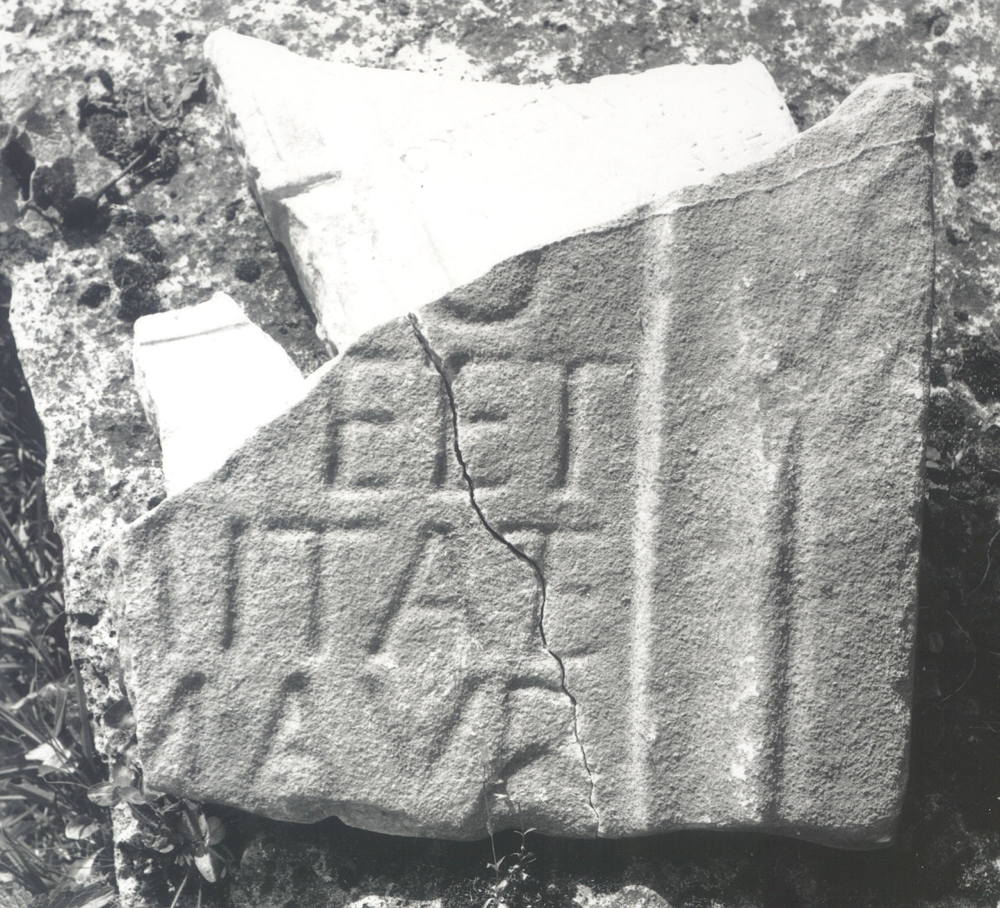
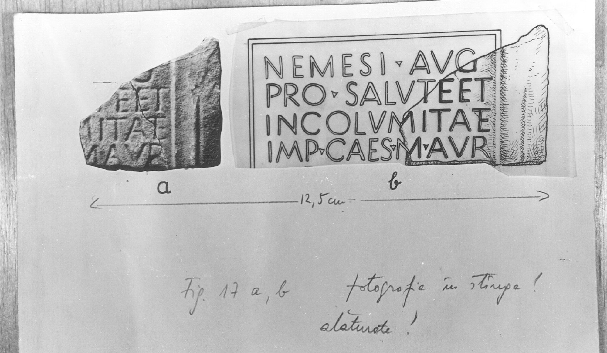

# EDH HD020563. Colonia Ulpia Traiana Sarmizegetusa

**Країна.** Румунія

**Провінція (код EDH).** Dac

**Місце знахідки (антична назва).** Colonia Ulpia Traiana Sarmizegetusa

**Сучасна назва.** Sarmizegetusa

**Деталі знахідки.** {Amphitheater}, bei

**Координати.** 45.516685035,22.785926378

**Зберігання.** Sarmizegetusa, Muz. Arh.

**Датування (роки, від'ємні до н. е.).** 161 … 222

**Тип пам'ятки.** Tafel

**Розміри (висота, ширина, глибина, см).** -27.0 × -28.0 × 8.0

## Текст (латинь, скорочення розкрито)

```
[Nemesi Au]g(ustae) / [pro salu]te et / [incolu]mitate / [Imp(eratoris) Caes(aris)] M(arci) Aur(eli) / [&
```

## Текст у вихідному записі

```
[ ]G / [ ]TE ET / [ ]MITATE / [ ] M AVR / [
```

## Коментар

(B): AE 1977: Z. 2: salut]e.

## Література

AE 1977, 0683. (B)
- IDR 3, 2, 312; fig. 257 (Foto u. Zeichnung).
- I. Piso, Sargetia 11/12, 1974/75, 66-67, Nr. 17; fig. 16 a; fig. 16 b (Zeichnung). - AE 1977. #

## Фото





Джерело https://edh.ub.uni-heidelberg.de/edh/inschrift/HD020563, ліцензія CC BY-SA 4.0. Оригінальний XML в архіві сирі_дані/edh_xml.zip
