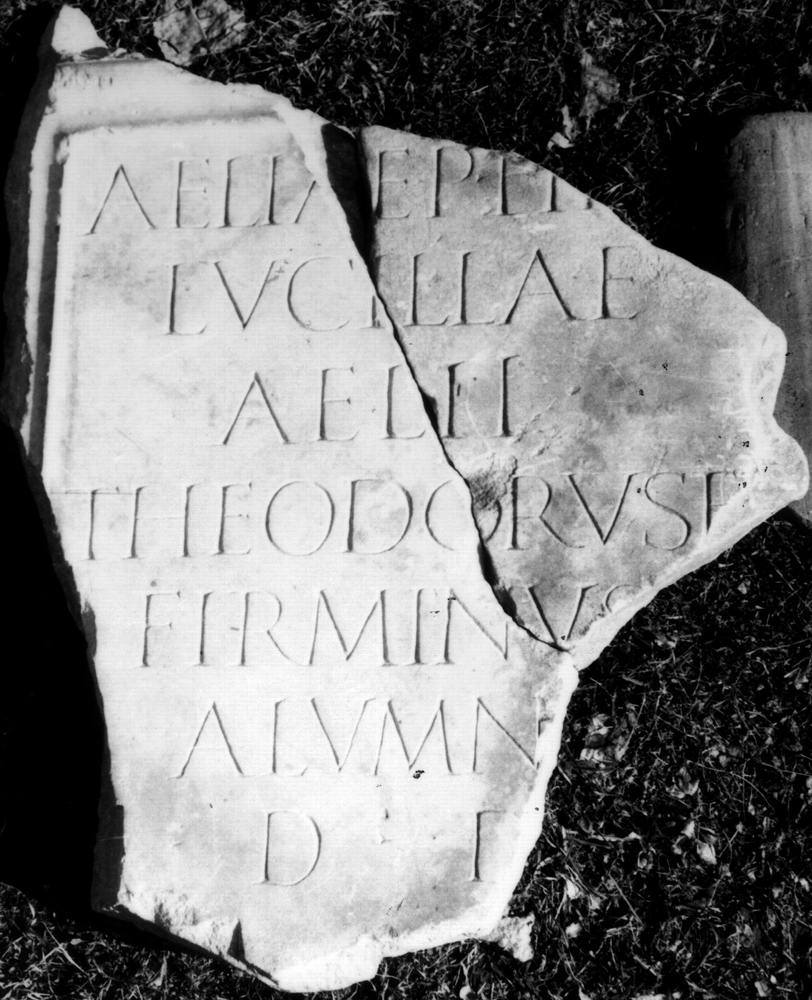
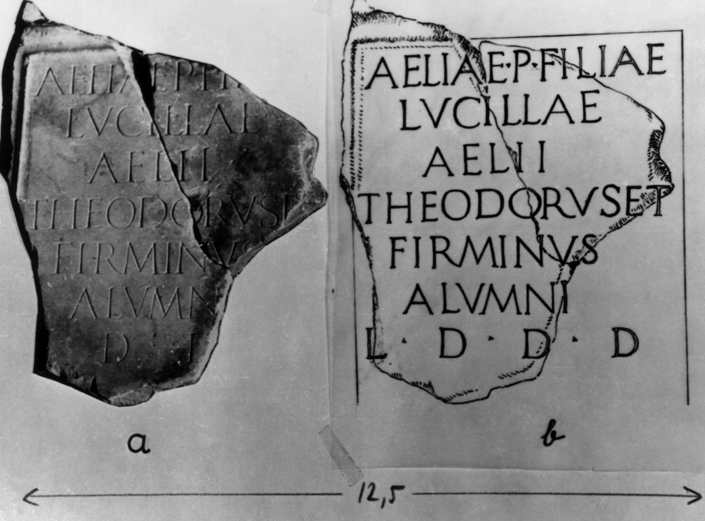
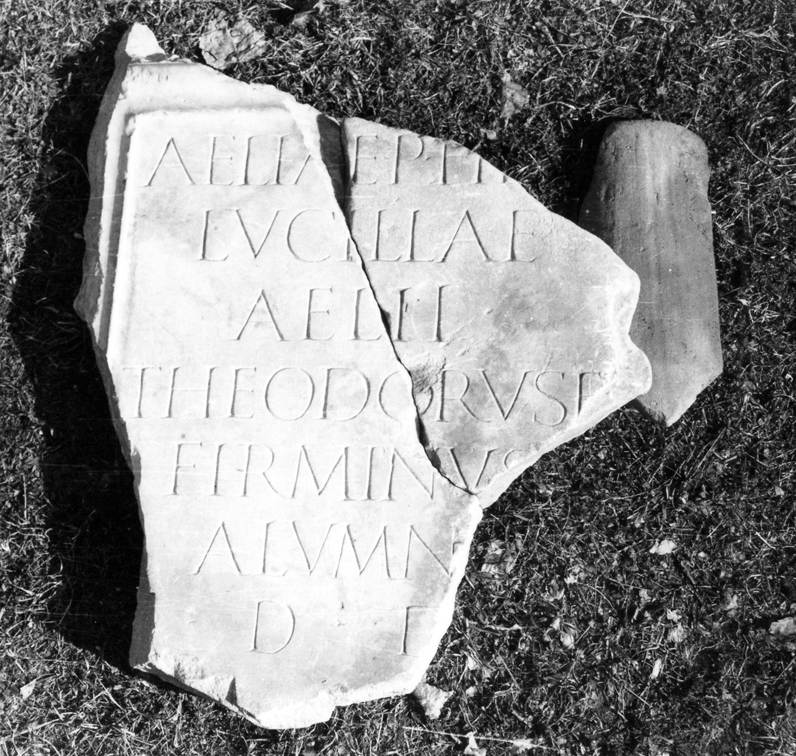

# EDH HD020569. Colonia Ulpia Traiana Sarmizegetusa

**Країна.** Румунія

**Провінція (код EDH).** Dac

**Місце знахідки (антична назва).** Colonia Ulpia Traiana Sarmizegetusa

**Сучасна назва.** Sarmizegetusa

**Деталі знахідки.** {Forum Vetus, Nord-West-Ecke}

**Координати.** 45.513504953,22.787401593

**Рік знахідки.** 1935

**Зберігання.** Sarmizegetusa, Muz. Arh.

**Датування (роки, від'ємні до н. е.).** 131 … 170

**Тип пам'ятки.** Tafel

**Розміри (висота, ширина, глибина, см).** -64.0 × -54.0 × 13.0

## Текст (латинь, скорочення розкрито)

```
Aeliae P(ubli) fil[iae] / Lucillae / Aelii / Theodorus et / Firminus / alumn[i] / l(oco) d(ato) d(ecreto) [d(ecurionum)]
```

## Текст у вихідному записі

```
AELIAE P FIL[ ] / LVCILLAE / AELII / THEODORVS ET / FIRMINVS / ALVMN[ ] / L D D [ ]
```

## Коментар

(B): Piso, AE 1977, IDR: geringfügig abweichende Textwiedergaben.

## Література

AE 1977, 0685. (B)
- IDR 3, 2, 103; fig. 81 (Foto u. Zeichnung). (B)
- I. Piso, Sargetia 11/12, 1974/75, 70, Nr. 22; fig. 22 a; fig. 22 b (Zeichnung). (B) - AE 1977. #

## Фото







Джерело https://edh.ub.uni-heidelberg.de/edh/inschrift/HD020569, ліцензія CC BY-SA 4.0. Оригінальний XML в архіві сирі_дані/edh_xml.zip
