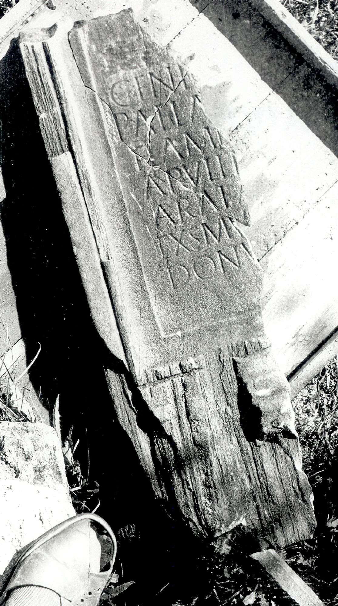

# EDH HD020581. Colonia Ulpia Traiana Sarmizegetusa

**Країна.** Румунія

**Провінція (код EDH).** Dac

**Місце знахідки (антична назва).** Colonia Ulpia Traiana Sarmizegetusa

**Сучасна назва.** Sarmizegetusa

**Деталі знахідки.** {Provinzialforum}

**Координати.** 45.516962857,22.788283824

**Рік знахідки.** 1974

**Зберігання.** Sarmizegetusa, Muz. Arh.

**Датування (роки, від'ємні до н. е.).** 201 … 222

**Тип пам'ятки.** Statuenbasis?

**Розміри (висота, ширина, глибина, см).** -92.0 × -33.0 × 7.0

## Текст (латинь, скорочення розкрито)

```
[[Numini Imp(erator--) Caes(ar--)?]] / [[---? et]] / Geni[o Daciar(um)] / P(ublius) Ael(ius) A[ntipater] / flame[n colon(iae)] / Apulen[sis sac(erdos)] / arae A[ugusti] / exs(!) mu[neribus?] / donu[m dedit]
```

## Текст у вихідному записі

```
[[NVMINI IMP CAES]] / [[ ET]] / GENI[ ] / P AEL A[ ] / FLAME[ ] / APVLEN[ ] / ARAE A[ ] / EXS MV[ ] / DONV[ ]
```

## Коментар

(B): Z. 7: Daicoviciu - Piso, AE 1977, IDR: arae A[ugusti n(ostri)].

## Література

AE 2001, 1718.
- AE 1977, 0689. (B)
- ILD 246.
- IDR 3, 2, 217; fig. 175 (Foto u. Zeichnung). (B)
- Á. Szabó, AAntHung 41, 2001, 99-103; Abb. 1 u. 2 (Zeichnungen). - AE 2001.
- H. Daicoviciu - I. Piso, in: D.M. Pippidi - E. Popescu (Hrsg.), Epigraphica.
- Travaux dédiés au VIIe Congrès d'Épigraphie Grecque et Latine (Constantza 1977) 75-78; fig. 1; fig. 2 (Zeichnung). (B) - AE 1977. #

## Фото



Джерело https://edh.ub.uni-heidelberg.de/edh/inschrift/HD020581, ліцензія CC BY-SA 4.0. Оригінальний XML в архіві сирі_дані/edh_xml.zip
