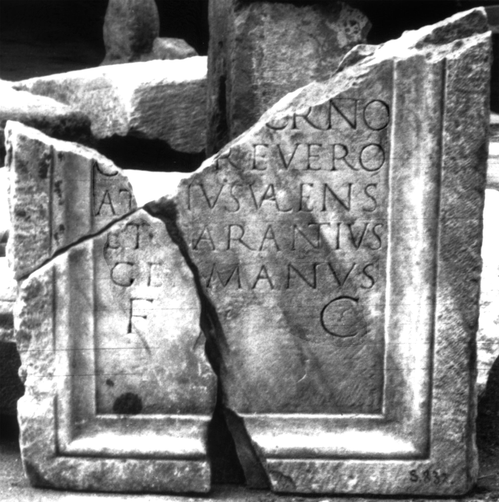

# EDH HD020587. Colonia Ulpia Traiana Sarmizegetusa

**Країна.** Румунія

**Провінція (код EDH).** Dac

**Місце знахідки (антична назва).** Colonia Ulpia Traiana Sarmizegetusa

**Сучасна назва.** Sarmizegetusa

**Координати.** 45.516666699,22.783333299

**Зберігання.** Sarmizegetusa, Muz. Arh.

**Датування (роки, від'ємні до н. е.).** 101 … 200

**Матеріал.** Marmor

**Тип пам'ятки.** Tafel

**Розміри (висота, ширина, глибина, см).** 62.0 × 60.0 × 7.0

## Текст (латинь, скорочення розкрито)

```
[D(is)] M(anibus) / [--- M]acrino / c[ivi] Trevero / At[t]ius Valens / et Carantius / Germanus / f(aciendum) c(uraverunt)
```

## Текст у вихідному записі

```
[ ] M / [ ]ACRINO / C[ ] TREVERO / AT[ ]IVS VALENS / ET CARANTIVS / GERMANVS / F C
```

## Коментар

Drei aneinander passende Fragmente erhalten. (B): AE 1977: geringfügigi abweichende Textwiedergabe.

## Література

AE 1977, 0691. (B)
- IDR 3, 2, 427; fig. 339 (Foto u. Zeichnung). (B)
- I. Piso, Apulum 14, 1976, 441-444, Nr. 2; fig. 2 (Foto u. Zeichnung). (B) - AE 1977.
- C. Ciongradi, Grabmonument und sozialer Status in Oberdakien (Cluj-Napoca 2007) 152, Nr. S/S 37; Taf. 38. #

## Фото



Джерело https://edh.ub.uni-heidelberg.de/edh/inschrift/HD020587, ліцензія CC BY-SA 4.0. Оригінальний XML в архіві сирі_дані/edh_xml.zip
